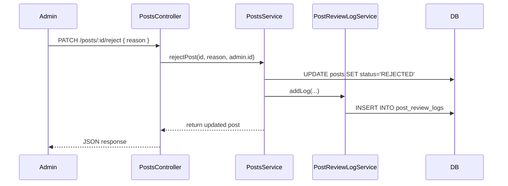

## 🧩 Tóm tắt toàn bộ hội thoại: Xử lý entity `PostReviewLog`, ràng buộc NOT NULL và lỗi TypeORM

### 💬 1️⃣ Chuỗi câu hỏi ban đầu của bạn
https://chatgpt.com/share/68e95f7c-8ca0-800c-a3e7-5aa9c204cedb
Bạn bắt đầu từ ảnh lỗi Postman với thông báo:

```
Cannot GET /post-review
```

→ Bạn hỏi: *"module bị thiếu ở đâu?"*

Sau đó, bạn liên tục đặt các câu hỏi liên quan đến module, entity và service của NestJS–TypeORM như:

1. **Module có bị thiếu không?**
   Bạn gửi đoạn `@Module({...})` và hỏi: “Có bị thiếu gì không?”
2. **Cách inject repository đúng trong service.**
   Bạn viết sai cú pháp `constructor(){ @Injectable private readonly repo... }` và hỏi “how?”
3. **Quan hệ `actor` trong entity bị null.**
   Bạn gửi ảnh JSON trả về `actor: null` và hỏi tại sao.
4. **Cách dùng `eager` trong `ManyToOne`.**
   Bạn hỏi: “vậy cái này theo eager hả?”
5. **Thiết kế API reject post (admin từ chối bài).**
   Bạn gửi ERD và hỏi: “vẽ tui 1 bức tranh làm API đi, thứ tự sao?”
6. **Hỏi có cần tạo API riêng cho post_review_logs không.**
7. **Hỏi có nên API này gọi API khác không (có tốn sức không).**
8. **Hỏi về việc inject service và repo trong cùng service.**
9. **Gặp lỗi PostgreSQL:** `null value in column "action" violates not-null constraint`.
   → Bạn hỏi: “nó bảo vi phạm not null là sao chưa hiểu.”
10. **Gặp lỗi TypeScript:** `No overload matches this call` và hỏi “overload là sao”.
11. **Gửi lại code create() và hỏi tại sao lỗi.”**
12. **Gửi ảnh lỗi mới: `'postId' does not exist in type DeepPartial<PostReviewLog>`**.
13. **Cuối cùng hỏi:**

    > “@Column({ name: 'action', type: 'enum', enum: ReviewActionEnum }) action!: ReviewActionEnum;
    > này đã ràng buộc not null rồi đúng k?”

---

### 🧠 2️⃣ Tóm tắt toàn bộ câu trả lời của mình

#### (1) Lỗi `Cannot GET /post-review`

* Nguyên nhân: Module hoặc controller chưa được import vào `AppModule`.
* Fix:

```ts
@Module({
  imports: [PostReviewModule],
})
export class AppModule {}
```

---

#### (2) Inject Repository đúng cách

Bạn viết sai cú pháp trong constructor.
Cú pháp đúng:

```ts
@Injectable()
export class PostReviewService {
  constructor(
    @InjectRepository(PostReviewLog)
    private readonly postReviewRepo: Repository<PostReviewLog>,
  ) {}
}
```

---

#### (3) Quan hệ `actor` bị null

Nguyên nhân: bạn chưa load relation.
Fix:

```ts
this.repo.find({ relations: ['actor'] });
```

Hoặc bật `eager: true` trong `@ManyToOne`.

---

#### (4) Eager và Quan hệ `actor`

* `eager: true` giúp luôn tự động join actor.
* Không nên bật mọi nơi vì tốn truy vấn, chỉ bật khi luôn cần.

---

#### (5) Luồng Reject Post API (Admin từ chối bài)

* Gọi: `PATCH /posts/:id/reject`
* `PostsService` cập nhật bảng `posts` và gọi `PostReviewLogService.addLog()` để ghi lịch sử.
* Thứ tự xử lý:



---

#### (6) Có cần API riêng cho `post_review_logs` không?

* Không cần API tạo log riêng.
* Chỉ cần service nội bộ `PostReviewLogService.addLog()`.
* Nếu cần xem lịch sử: thêm API `GET /posts/:id/review-logs` để đọc log.

---

#### (7) Có nên API gọi API khác?

* Không nên. Gọi trực tiếp service khác trong cùng process (nhanh và nhẹ hơn nhiều).
* Nếu tách microservice → dùng event hoặc gRPC.

---

#### (8) Inject service và repo

* Cách tốt: inject `PostReviewLogService` trong `PostsService` để tái dùng logic.
* Nếu cần transaction → truyền `manager` hoặc `repo` vào `addLogTx()`.

---

#### (9) Lỗi `null value in column "action" violates not-null constraint`

* Nghĩa: bạn insert record mà không có `action`.
* Fix: gán enum rõ ràng.

```ts
action: ReviewActionEnum.REJECTED,
```

Hoặc cho phép null:

```ts
@Column({ nullable: true })
action?: ReviewActionEnum | null;
```

---

#### (10) Lỗi TypeScript `No overload matches this call`

* Do bạn truyền sai field (`post` hoặc `postId` không tồn tại trong entity).
* Và truyền string vào enum.
  Fix:

```ts
const reviewLog = this.repo.create({
  postId: data.postId, // entity phải có cột này
  action: ReviewActionEnum.REJECTED,
});
```

---

#### (11) Lỗi `'postId' does not exist in DeepPartial<PostReviewLog>`

* Nghĩa: entity của bạn không có `@Column({ name: 'post_id' }) postId`.
  Fix: thêm vào entity.

```ts
@Column({ name: 'post_id', type: 'bigint' })
postId: string;
```

---

#### (12) Ràng buộc NOT NULL của cột `action`

* Mặc định `nullable: false` → **đã là NOT NULL.**
* Nếu muốn cho phép null → thêm `nullable: true`.

Ví dụ:

```ts
@Column({ name: 'action', type: 'enum', enum: ReviewActionEnum })
action!: ReviewActionEnum; // NOT NULL mặc định
```

Khi migration chạy:

```sql
"action" review_action_enum NOT NULL
```

---

### ✅ 3️⃣ Kết luận tổng thể

* **Module**: thiếu import → thêm vào AppModule.
* **Service**: inject repo đúng cú pháp.
* **Entity**: load relation hoặc bật eager.
* **Reject flow**: PostsService đổi status → gọi LogService ghi log.
* **Không cần API log riêng** → dùng nội bộ service.
* **Không gọi API sang API** → gọi service trực tiếp.
* **Fix lỗi NOT NULL** → luôn truyền `action` enum.
* **Fix overload** → sửa field `postId` đúng với entity.
* **Cột enum** mặc định **NOT NULL** trừ khi `nullable: true`.

---

### 📦 4️⃣ Code mẫu hoàn chỉnh (chuẩn clean NestJS + TypeORM)

```ts
// review-action.enum.ts
export enum ReviewActionEnum {
  APPROVED = 'APPROVED',
  REJECTED = 'REJECTED',
}

// post-review-log.entity.ts
@Entity('post_review_logs')
export class PostReviewLog {
  @PrimaryGeneratedColumn()
  id: number;

  @Column({ name: 'post_id', type: 'bigint' })
  postId: string;

  @ManyToOne(() => Post, { onDelete: 'CASCADE' })
  @JoinColumn({ name: 'post_id' })
  post: Post;

  @ManyToOne(() => Account, { nullable: true, onDelete: 'SET NULL' })
  @JoinColumn({ name: 'actor_id' })
  actor: Account | null;

  @Column({ name: 'old_status', type: 'varchar', nullable: false })
  oldStatus: string;

  @Column({ name: 'new_status', type: 'varchar', nullable: false })
  newStatus: string;

  @Column({ name: 'reason', type: 'text', nullable: true })
  reason?: string;

  @Column({ name: 'action', type: 'enum', enum: ReviewActionEnum })
  action!: ReviewActionEnum; // NOT NULL mặc định

  @CreateDateColumn({ name: 'created_at', type: 'timestamptz' })
  createdAt: Date;
}

// post-review-log.service.ts
@Injectable()
export class PostReviewLogService {
  constructor(
    @InjectRepository(PostReviewLog)
    private readonly repo: Repository<PostReviewLog>,
  ) {}

  async addLog(dto: {
    postId: number | string;
    actorId?: number | null;
    oldStatus: string;
    newStatus: string;
    reason?: string;
    action: ReviewActionEnum;
  }) {
    const log = this.repo.create({
      postId: String(dto.postId),
      actorId: dto.actorId ?? null,
      oldStatus: dto.oldStatus,
      newStatus: dto.newStatus,
      reason: dto.reason,
      action: dto.action,
    });
    return this.repo.save(log);
  }
}

// posts.service.ts
@Injectable()
export class PostsService {
  constructor(
    @InjectRepository(Post) private readonly postRepo: Repository<Post>,
    private readonly logService: PostReviewLogService,
  ) {}

  async rejectPost(id: number, reason: string, adminId: number) {
    const post = await this.postRepo.findOneByOrFail({ id });
    const oldStatus = post.status;

    post.status = PostStatus.REJECTED;
    post.rejectReason = reason;
    post.reviewedBy = adminId;
    post.reviewedAt = new Date();

    await this.postRepo.save(post);

    await this.logService.addLog({
      postId: id,
      actorId: adminId,
      oldStatus,
      newStatus: PostStatus.REJECTED,
      reason,
      action: ReviewActionEnum.REJECTED,
    });

    return post;
  }
}
```

---

### 📚 5️⃣ Tổng kết logic cuối cùng

> Khi admin bấm **Từ chối bài**, API `PATCH /posts/:id/reject` được gọi → `PostsService` đổi status bài → gọi `PostReviewLogService.addLog()` để ghi lại lịch sử.
> Nếu không truyền `action`, PostgreSQL báo lỗi `null violates not-null constraint`.
> Fix bằng cách truyền enum rõ ràng `ReviewActionEnum.REJECTED`.
