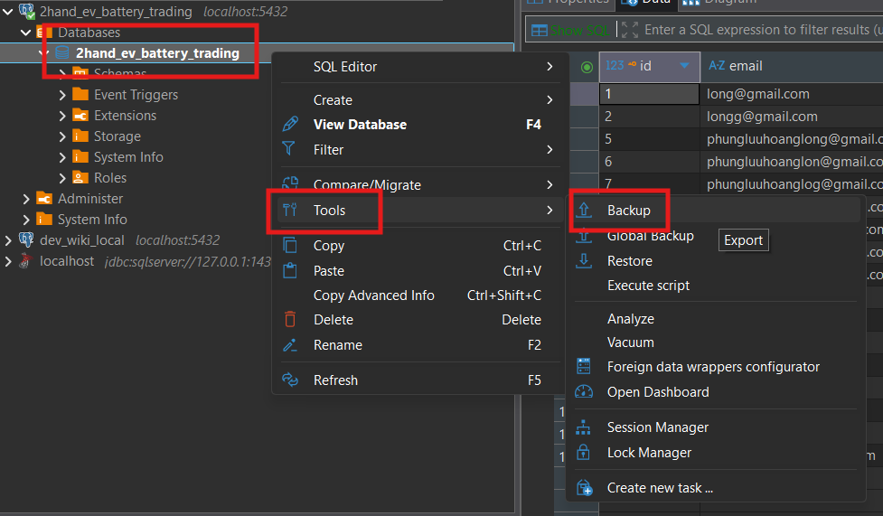
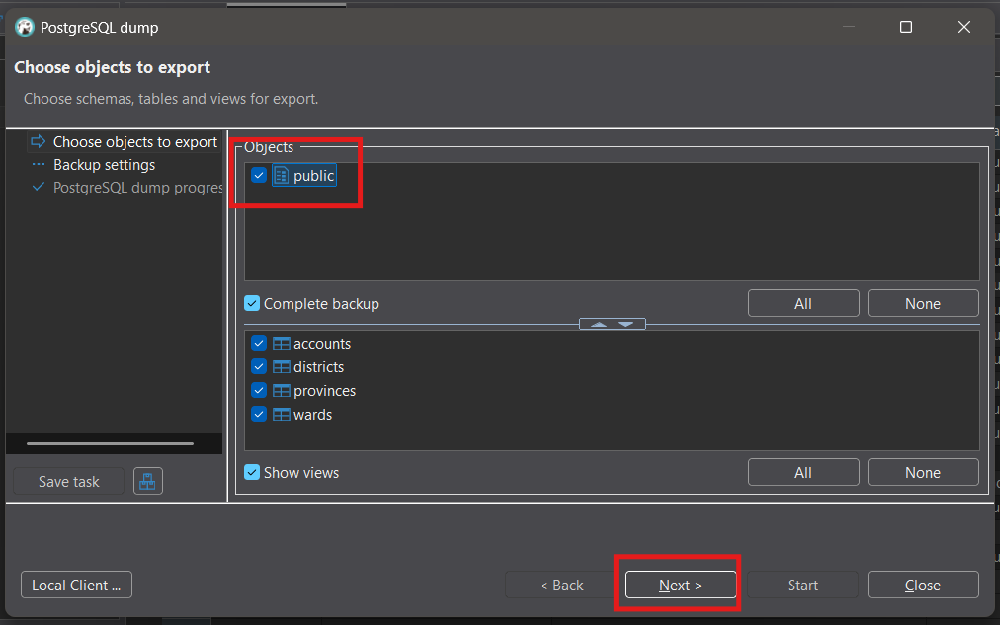
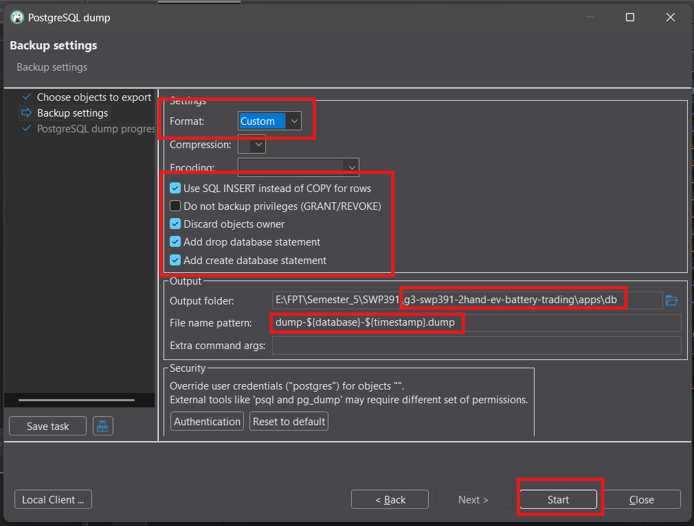

# Backup PostgreSQL Database Dump Using DBeaver

> This guide shows how to create a PostgreSQL backup dump file using DBeaver, with screenshots and recommended settings. The output file will be saved directly in `/apps/db/`.

## 1. Open DBeaver and Select Your Database

1. In the DBeaver database navigator, **right-click your database** (e.g., `2hand_ev_battery_trading`).
2. Go to **Tools** → **Backup**.

## 2. Select Schema and Tables

1. In the backup wizard, **select the `public` schema** (this will select all tables).
2. Click **Next**.

## 3. Configure Backup Settings

1. In the backup settings:

- **Format**: Choose `Custom`
- **Options**: Tick these 4 checkboxes:
  - Use SQL INSERT commands instead of COPY
  - Discard objects owner
  - Add DROP database statement
  - Add CREATE database statement
- **Output folder**: Set to `/apps/db/` in your project
- **File name pattern**: `dump-${database}-${timestamp}.dump`

2. Click **Start** to begin the backup.

---

**Result:**

- Your backup file (e.g., `dump-2hand_ev_battery_trading-20250818.dump`) will appear in `/apps/db/`.
- You can now use this file for local development or restore.
