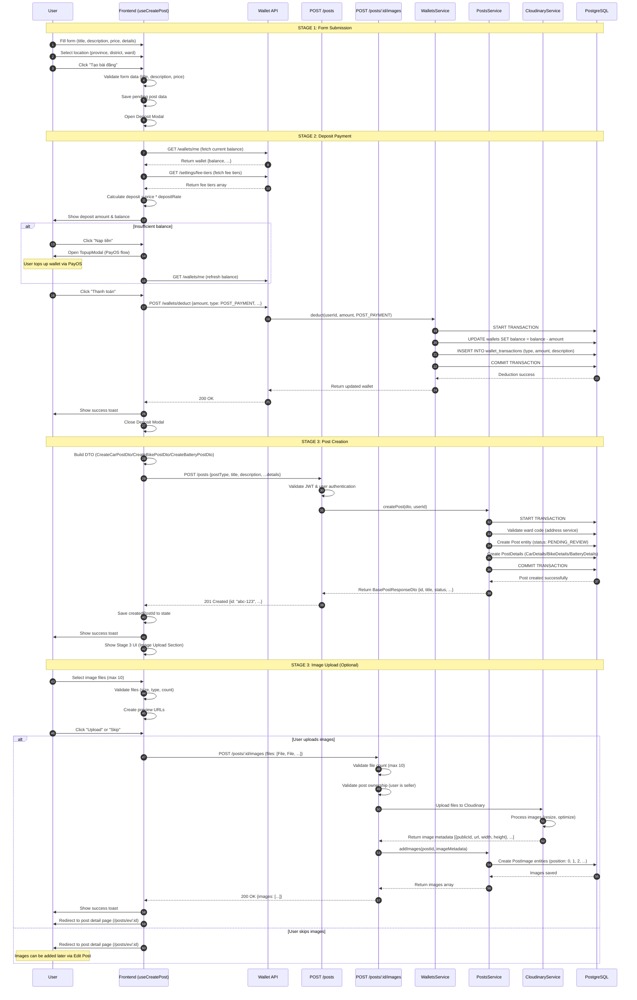
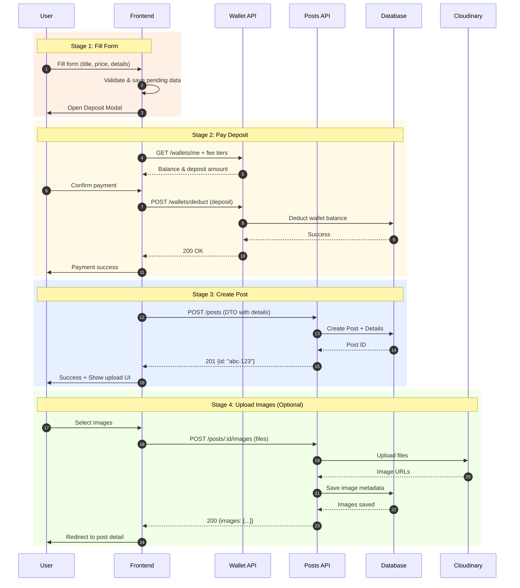
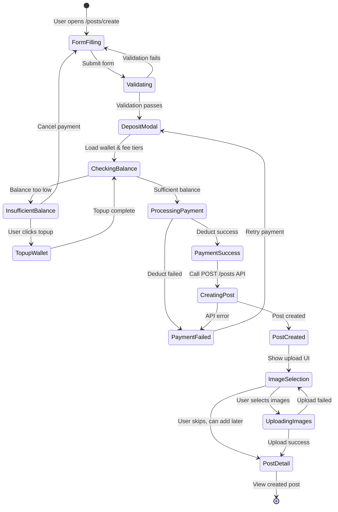

# Post Creation Flow

## Overview

This document describes the **3-stage post creation workflow** on the 2nd-hand EV Battery Trading Platform. Users create posts (listings) for selling EV batteries, cars, or bikes through a **sequential process**:

1. **Stage 1 - Form Submission**: User fills form with post details
2. **Stage 2 - Deposit Payment**: User pays deposit fee from wallet (percentage of post price)
3. **Stage 3 - Post Creation & Image Upload**: Backend creates post → User uploads images (optional)

This flow requires **wallet payment** before post creation. The deposit amount is calculated based on fee tiers (percentage of post price).

---

## System Architecture

### Tech Stack
- **Frontend**: Next.js 15 (App Router), React Hook Form, TypeScript, Tailwind CSS
- **Backend**: NestJS, TypeORM, PostgreSQL
- **Image Storage**: Cloudinary
- **Database**: PostgreSQL with transaction support

### Key Components

#### Frontend (`apps/web`)
- **Page**: `apps/web/app/(public)/posts/create/page.tsx` - Main creation page
- **Hook**: `apps/web/app/(public)/posts/create/_hooks/useCreatePost.ts` - Business logic
- **Components**:
  - Form components for Car/Bike/Battery details
  - `ImageUploadSection.tsx` - Stage 2 image upload UI
- **API Client**: `apps/web/lib/api/postApi.ts` - API calls

#### Backend (`apps/api`)
- **Controller**: `apps/api/src/modules/posts/posts.controller.ts`
- **Service**: `apps/api/src/modules/posts/posts.service.ts`
- **Entities**: `Post`, `PostImage`, `CarDetails`, `BikeDetails`, `BatteryDetails`
- **Upload**: Cloudinary service for image processing

---

## Complete Post Creation Flow



---

## Simplified Post Creation Flow

For easier understanding, here's a simplified version focusing on the main steps:



---

## State Diagram



---

## API Endpoints

### 1. Get Wallet Balance (Stage 2)

**Endpoint**: `GET /wallets/me`

**Authentication**: Required (JWT Bearer token)

**Success Response (200)**:
```typescript
{
  id: number,
  userId: number,
  balance: string, // Balance in VND
  createdAt: string,
  updatedAt: string
}
```

---

### 2. Get Fee Tiers (Stage 2)

**Endpoint**: `GET /settings/fee-tiers`

**Authentication**: Not required (public data)

**Success Response (200)**:
```typescript
[
  {
    id: number,
    minPrice: string, // Minimum post price in VND
    maxPrice: string | null, // Maximum post price (null = unlimited)
    depositRate: number, // Deposit rate (0.0-1.0, e.g., 0.05 = 5%)
    active: boolean,
    createdAt: string,
    updatedAt: string
  },
  // ... more tiers
]
```

**Example Fee Tiers**:
- 0-10,000,000 VND → 5% deposit
- 10,000,001-50,000,000 VND → 3% deposit  
- 50,000,001+ VND → 2% deposit

---

### 3. Deduct Wallet for Deposit (Stage 2)

**Endpoint**: `POST /wallets/deduct`

**Authentication**: Required (JWT Bearer token)

**Request Body**:
```typescript
{
  amount: string, // Amount to deduct in VND
  serviceType: "POST_PAYMENT",
  description: string, // e.g., "Phí đặt cọc đăng bài"
  relatedEntityType: string, // e.g., "payment_orders"
  relatedEntityId: string // Payment order ID
}
```

**Success Response (200)**:
```typescript
{
  id: number,
  userId: number,
  balance: string, // Updated balance after deduction
  createdAt: string,
  updatedAt: string
}
```

**Error Responses**:
- `400 Bad Request`: Insufficient balance / Invalid amount
- `401 Unauthorized`: Missing or invalid JWT token
- `500 Internal Server Error`: Database transaction failed

---

### 4. Create Post (Stage 3)

**Endpoint**: `POST /posts`

**Authentication**: Required (JWT Bearer token)

**Request Body**:

**For Car Post**:
```typescript
{
  postType: "EV_CAR",
  title: string,
  description: string,
  wardCode: string,
  provinceNameCached?: string,
  districtNameCached?: string,
  wardNameCached?: string,
  addressTextCached?: string,
  priceVnd: string, // Numeric string, e.g., "150000000"
  isNegotiable: boolean,
  carDetails: {
    brand_id?: number,
    model_id?: number,
    manufacture_year: number,
    body_style?: string, // "SEDAN" | "SUV" | "HATCHBACK" | "OTHER"
    origin: string,
    color: string,
    seats: number,
    license_plate: string,
    owners_count: number,
    odo_km: number,
    battery_capacity_kwh: number,
    range_km: number,
    charge_ac_kw: number,
    charge_dc_kw: number,
    battery_health_pct: number
  }
}
```

**For Bike Post**:
```typescript
{
  postType: "EV_BIKE",
  title: string,
  description: string,
  wardCode: string,
  provinceNameCached?: string,
  districtNameCached?: string,
  wardNameCached?: string,
  addressTextCached?: string,
  priceVnd: string,
  isNegotiable: boolean,
  bikeDetails: {
    brand_id?: number,
    model_id?: number,
    manufacture_year: number,
    bike_style?: string, // "SCOOTER" | "SPORT" | "UNDERBONE" | "OTHER"
    origin: string,
    color: string,
    license_plate: string,
    owners_count: number,
    odo_km: number,
    battery_capacity_kwh: number,
    range_km: number,
    motor_power_kw: number,
    charge_ac_kw: number,
    battery_health_pct: number
  }
}
```

**For Battery Post**:
```typescript
{
  postType: "BATTERY",
  title: string,
  description: string,
  wardCode: string,
  provinceNameCached?: string,
  districtNameCached?: string,
  wardNameCached?: string,
  addressTextCached?: string,
  priceVnd: string,
  isNegotiable: boolean,
  batteryDetails: {
    brand_id?: number,
    voltageV: number,
    capacityAh: number,
    chargeTimeHours: number,
    chemistry?: string, // "LFP" | "NMC" | "NCA" | "LTO"
    origin: string,
    weightKg: number,
    cycleLife: number,
    rangeKm: number,
    compatibleNotes: string
  }
}
```

**Success Response (201)**:
```typescript
{
  id: string,
  postType: "EV_CAR" | "EV_BIKE" | "BATTERY",
  title: string,
  description: string,
  wardCode: string,
  provinceNameCached: string | null,
  districtNameCached: string | null,
  wardNameCached: string | null,
  addressTextCached: string | null,
  priceVnd: string,
  isNegotiable: boolean,
  status: "PENDING_REVIEW", // Initial status
  seller: {
    id: number,
    email: string | null,
    phone: string | null,
    fullName: string | null,
    avatarUrl: string | null
  },
  carDetails?: {...}, // If postType is EV_CAR
  bikeDetails?: {...}, // If postType is EV_BIKE
  batteryDetails?: {...}, // If postType is BATTERY
  images: [], // Empty on creation
  createdAt: string,
  updatedAt: string
}
```

**Error Responses**:
- `400 Bad Request`: Invalid data (validation failed)
- `401 Unauthorized`: Missing or invalid JWT token
- `500 Internal Server Error`: Database or server error

---

### 5. Upload Post Images (Stage 4)

**Endpoint**: `POST /posts/:postId/images`

**Authentication**: Required (JWT Bearer token)

**Request Body**: `multipart/form-data`

```typescript
{
  files: File[] // Max 10 files
}
```

**File Validation**:
- **Max count**: 10 images per upload
- **Allowed types**: `image/jpeg`, `image/jpg`, `image/png`, `image/gif`, `image/webp`
- **Max size**: 2MB per file (frontend validation)
- **Processing**: Uploaded to Cloudinary, resized and optimized

**Success Response (200)**:
```typescript
{
  images: [
    {
      public_id: string, // Cloudinary public ID
      url: string, // Full image URL
      width: number,
      height: number,
      bytes: number,
      format: string | null
    },
    // ... more images
  ]
}
```

**Error Responses**:
- `400 Bad Request`: No files provided / Invalid postId / File validation failed
- `401 Unauthorized`: Missing or invalid JWT token
- `403 Forbidden`: User is not the post owner
- `404 Not Found`: Post not found
- `500 Internal Server Error`: Cloudinary upload or database error

---

## Database Schema

### Post Entity

```typescript
@Entity('posts')
export class Post {
  @PrimaryGeneratedColumn('uuid')
  id: string;

  @Column({ type: 'enum', enum: PostType })
  postType: 'EV_CAR' | 'EV_BIKE' | 'BATTERY';

  @Column({ length: 200 })
  title: string;

  @Column({ type: 'text' })
  description: string;

  @Column({ length: 20 })
  wardCode: string;

  @Column({ type: 'varchar', length: 100, nullable: true })
  provinceNameCached: string | null;

  @Column({ type: 'varchar', length: 100, nullable: true })
  districtNameCached: string | null;

  @Column({ type: 'varchar', length: 100, nullable: true })
  wardNameCached: string | null;

  @Column({ type: 'varchar', length: 255, nullable: true })
  addressTextCached: string | null;

  @Column({ type: 'decimal', precision: 15, scale: 0 })
  priceVnd: string;

  @Column({ type: 'boolean', default: false })
  isNegotiable: boolean;

  @Column({ type: 'enum', enum: PostStatus, default: PostStatus.PENDING_REVIEW })
  status: 'DRAFT' | 'PENDING_REVIEW' | 'PUBLISHED' | 'REJECTED' | 'ARCHIVED';

  @ManyToOne(() => Account)
  @JoinColumn({ name: 'seller_id' })
  seller: Account;

  @OneToOne(() => CarDetails, { cascade: true })
  carDetails?: CarDetails;

  @OneToOne(() => BikeDetails, { cascade: true })
  bikeDetails?: BikeDetails;

  @OneToOne(() => BatteryDetails, { cascade: true })
  batteryDetails?: BatteryDetails;

  @OneToMany(() => PostImage, (img) => img.post)
  images: PostImage[];

  @CreateDateColumn()
  createdAt: Date;

  @UpdateDateColumn()
  updatedAt: Date;
}
```

### PostImage Entity

```typescript
@Entity('post_images')
export class PostImage {
  @PrimaryGeneratedColumn('uuid')
  id: string;

  @Column()
  post_id: string;

  @ManyToOne(() => Post, (post) => post.images)
  @JoinColumn({ name: 'post_id' })
  post: Post;

  @Column({ length: 255, unique: true })
  public_id: string; // Cloudinary public_id

  @Column({ type: 'text' })
  url: string; // Full Cloudinary URL

  @Column({ type: 'int' })
  width: number;

  @Column({ type: 'int' })
  height: number;

  @Column({ type: 'int' })
  bytes: number;

  @Column({ type: 'varchar', length: 20, nullable: true })
  format: string | null;

  @Column({ type: 'int' })
  position: number; // 0 = main image, 1-9 = additional

  @CreateDateColumn()
  createdAt: Date;
}
```

---

## Frontend Implementation

### useCreatePost Hook

**Location**: `apps/web/app/(public)/posts/create/_hooks/useCreatePost.ts`

**Key State Management**:

```typescript
// Post creation state
const [postType, setPostType] = useState<PostType | null>(null);
const [formData, setFormData] = useState<FormData>(initialFormData);
const [isSubmitting, setIsSubmitting] = useState(false);

// Stage 2 - Deposit payment state
const [isDepositModalOpen, setIsDepositModalOpen] = useState(false);
const [pendingPostData, setPendingPostData] = useState<{
  postType: PostType;
  priceVnd: string;
} | null>(null);

// Stage 3 - Image upload state
const [createdPostId, setCreatedPostId] = useState<string | null>(null);
const [selectedFiles, setSelectedFiles] = useState<File[]>([]);
const [previewUrls, setPreviewUrls] = useState<string[]>([]);
const [isUploadingImages, setIsUploadingImages] = useState(false);
```

**Stage 1 - Form Submission & Validation**:

```typescript
const handleSubmit = async (e: React.FormEvent) => {
  e.preventDefault();

  if (!postType) {
    toast.error('Vui lòng chọn loại tin đăng');
    return;
  }

  // Validate price
  const priceValue = unformatNumber(formData.priceVnd);
  if (!priceValue || parseFloat(priceValue) <= 0) {
    toast.error('Vui lòng nhập giá bài đăng hợp lệ');
    return;
  }

  // Save post data and open deposit modal
  setPendingPostData({
    postType,
    priceVnd: priceValue,
  });
  setIsDepositModalOpen(true);
};
```

**Stage 2 - Deposit Payment (DepositModal Component)**:

The `DepositModal` component handles the payment flow:

```typescript
// In DepositModal.tsx
const DepositModal = ({ isOpen, onClose, priceVnd, onSuccess }) => {
  // Load wallet balance
  const wallet = await getMyWallet();
  
  // Load fee tiers and find matching tier
  const feeTiers = await getAllFeeTiers();
  const matchingTier = feeTiers.find(tier => 
    priceVnd >= tier.minPrice && priceVnd <= (tier.maxPrice || Infinity)
  );
  
  // Calculate deposit
  const depositAmount = Math.round(priceVnd * matchingTier.depositRate);
  
  // Handle payment
  const handlePayment = async () => {
    await deductWallet({
      amount: depositAmount.toString(),
      serviceType: 'POST_PAYMENT',
      description: 'Phí đặt cọc đăng bài',
    });
    
    // Call onSuccess to create post
    await onSuccess();
    onClose();
  };
};
```

**Stage 3 - Post Creation After Payment**:

```typescript
const handleCreatePostAfterDeposit = async () => {
  if (!postType || !pendingPostData) return;
  
  setIsSubmitting(true);

  try {
    let createdPost;
    
    if (formData.vehicleType === 'xe_hoi') {
      createdPost = await createCarPost(carPostData);
    } else if (formData.vehicleType === 'xe_may') {
      createdPost = await createBikePost(bikePostData);
    } else {
      createdPost = await createBatteryPost(batteryPostData);
    }

    toast.success('Tạo bài đăng thành công!');
    setCreatedPostId(createdPost.id); // Transition to Stage 4
  } catch (error) {
    toast.error('Tạo bài đăng thất bại');
  } finally {
    setIsSubmitting(false);
    setPendingPostData(null);
  }
};
```

**Stage 4 - Image Upload**:

```typescript
const handleImageUpload = async () => {
  if (!createdPostId || selectedFiles.length === 0) {
    toast.error('Vui lòng chọn ít nhất 1 hình ảnh');
    return;
  }

  setIsUploadingImages(true);

  try {
    await uploadPostImages(createdPostId, selectedFiles);
    toast.success('Upload ảnh thành công!');
    router.push(`/posts/ev/${createdPostId}`);
  } catch (error) {
    toast.error('Upload ảnh thất bại');
  } finally {
    setIsUploadingImages(false);
  }
};

const skipImageUpload = () => {
  if (createdPostId) {
    router.push(`/posts/ev/${createdPostId}`);
  }
};
```

---

## Backend Implementation

### PostsService - createPost Method

**Location**: `apps/api/src/modules/posts/posts.service.ts`

**Transaction Flow**:

```typescript
private async createPost(
  dto: CreateAnyPostDto,
  sellerId: number,
): Promise<BasePostResponseDto | null> {
  // Fetch address names if not provided
  if (!dto.provinceNameCached && !dto.districtNameCached && !dto.wardNameCached) {
    const fullAddress = await this.addressService.getFullAddressByWardCode(dto.wardCode);
    dto.provinceNameCached = fullAddress.data.province.name;
    dto.districtNameCached = fullAddress.data.district.name;
    dto.wardNameCached = fullAddress.data.ward.name;
  }

  // Build address text for caching
  dto.addressTextCached = buildAddressText(
    dto.wardNameCached,
    dto.districtNameCached,
    dto.provinceNameCached,
  );

  return this.postsRepo.manager.transaction(async (trx) => {
    // 1) Create Post entity
    const post = trx.create(Post, {
      seller: { id: sellerId } as Account,
      postType: dto.postType,
      title: dto.title,
      description: dto.description,
      wardCode: dto.wardCode,
      provinceNameCached: dto.provinceNameCached,
      districtNameCached: dto.districtNameCached,
      wardNameCached: dto.wardNameCached,
      addressTextCached: dto.addressTextCached,
      priceVnd: dto.priceVnd,
      isNegotiable: dto.isNegotiable,
      status: dto.status ?? PostStatus.PENDING_REVIEW,
    });
    const savedPost = await trx.save(Post, post);

    // 2) Create post-specific details based on postType
    switch (dto.postType) {
      case PostType.EV_CAR:
        await this.carDetailsService.createWithTrx(trx, {
          post_id: savedPost.id,
          ...dto.carDetails,
        });
        break;

      case PostType.EV_BIKE:
        await this.bikeDetailsService.createWithTrx(trx, {
          post_id: savedPost.id,
          ...dto.bikeDetails,
        });
        break;

      case PostType.BATTERY:
        await this.batteryDetailsService.createWithTrx(trx, {
          post_id: savedPost.id,
          ...dto.batteryDetails,
        });
        break;
    }

    // 3) Reload post with relations
    const fullPost = await trx.findOne(Post, {
      where: { id: savedPost.id },
      relations: [this.CAR_DETAILS, this.BIKE_DETAILS, this.BATTERY_DETAILS, this.SELLER],
    });

    return PostMapper.toBasePostResponseDto(fullPost);
  });
}
```

### PostsService - addImages Method

**Location**: `apps/api/src/modules/posts/posts.service.ts`

**Image Upload Flow**:

```typescript
async addImages(postId: string, images: CreatePostImageDto[]) {
  if (!images?.length) return [];

  // Ensure post exists
  const exists = await this.postsRepo.exists({ where: { id: postId } });
  if (!exists) throw new NotFoundException('Post not found');

  // Get current max position to append new images
  const last = await this.imagesRepo
    .createQueryBuilder('pi')
    .select('COALESCE(MAX(pi.position), 0)', 'max')
    .where('pi.post_id = :postId', { postId })
    .getRawOne<{ max: string }>();
  const basePos = Number(last?.max) || 0;

  // Create PostImage entities with sequential positions
  const entities = images.map((img, idx) =>
    this.imagesRepo.create({
      post_id: postId,
      public_id: img.public_id,
      url: img.url,
      width: img.width,
      height: img.height,
      bytes: img.bytes,
      format: img.format ?? null,
      position: basePos + idx + 1, // Append after existing images
    }),
  );

  try {
    return await this.imagesRepo.save(entities);
  } catch (e: any) {
    if (e.code === '23505') {
      throw new BadRequestException('public_id already exists');
    }
    throw e;
  }
}
```

---

## Business Rules

### Deposit Payment Rules

1. **Payment Required**: User MUST pay deposit before creating post
2. **Deposit Calculation**: Deposit = Post Price × Deposit Rate (from fee tier)
3. **Fee Tier Matching**: System finds fee tier where `minPrice ≤ postPrice ≤ maxPrice`
4. **Wallet Balance Check**: User must have sufficient balance in wallet
5. **Topup Option**: If insufficient balance, user can topup via PayOS
6. **Transaction Type**: Wallet transaction recorded as `POST_PAYMENT`
7. **Atomic Deduction**: Wallet deduction wrapped in database transaction
8. **Refund Policy**: Deposit is non-refundable once post is created

### Post Creation Rules

1. **Authentication Required**: User must be logged in with valid JWT token
2. **Payment Prerequisite**: Deposit must be paid successfully before post creation
3. **Initial Status**: New posts start in `PENDING_REVIEW` status
4. **Seller Assignment**: Post is automatically assigned to the authenticated user
5. **Address Caching**: Province, district, ward names are cached for performance
6. **Details Required**: Post must include type-specific details (car/bike/battery)
7. **Transaction Safety**: Post + Details creation wrapped in database transaction

### Image Upload Rules

1. **Optional Upload**: Images can be added during creation or later via Edit Post
2. **Max Count**: Maximum 10 images per post
3. **File Validation**: 
   - Allowed types: JPEG, JPG, PNG, GIF, WebP
   - Max size: 2MB per file (frontend), 5MB (backend)
4. **Ownership Check**: Only post owner can upload images
5. **Position Tracking**: Images have sequential positions (0 = main, 1-9 = additional)
6. **Cloudinary Storage**: Images uploaded to Cloudinary, metadata saved to database

### Data Validation

**Post Data**:
- Title: 2-200 characters
- Description: 10-5000 characters
- Price: Positive number, max 15 digits
- Ward Code: Valid code from address service

**Image Data**:
- public_id: Max 255 characters, unique
- URL: Valid URL format
- Dimensions: Width/height > 0
- Size: Bytes > 0

---

## Error Handling

### Frontend Error Handling

```typescript
// Stage 1 - Form submission errors
try {
  const createdPost = await createCarPost(carPostData);
  toast.success('Tạo bài đăng thành công!');
  setCreatedPostId(createdPost.id);
} catch (error: unknown) {
  const err = error as ApiError;
  const errorMessage = err?.response?.data?.message || 'Tạo bài đăng thất bại';
  toast.error(errorMessage);
}

// Stage 2 - Image upload errors
try {
  await uploadPostImages(createdPostId, selectedFiles);
  toast.success('Upload ảnh thành công!');
  router.push(`/posts/ev/${createdPostId}`);
} catch (error: unknown) {
  const err = error as ApiError;
  if (err?.response?.status === 404) {
    toast.warning('API upload chưa sẵn sàng');
  } else {
    toast.error('Upload ảnh thất bại');
  }
}
```

### Backend Error Handling

```typescript
// Post creation errors
- BadRequestException: Invalid input data
- NotFoundException: Address/catalog data not found
- InternalServerErrorException: Database transaction failed

// Image upload errors
- BadRequestException: No files / Duplicate public_id
- NotFoundException: Post not found
- ForbiddenException: User not post owner
- InternalServerErrorException: Cloudinary upload failed
```

---

## Testing Scenarios

### Stage 1 - Form Submission

#### Happy Path
1. User fills complete form with valid data
2. Clicks "Tạo bài đăng"
3. Frontend validates form (title, description, price)
4. Frontend saves pending post data
5. Frontend opens Deposit Modal

#### Error Cases
- **Missing required fields**: Frontend validation prevents submission
- **Invalid price (≤0)**: Frontend shows error message
- **Invalid title/description**: Frontend validation errors

---

### Stage 2 - Deposit Payment

#### Happy Path (Sufficient Balance)
1. Deposit Modal opens
2. Frontend fetches wallet balance + fee tiers
3. System calculates deposit (price × deposit rate)
4. User sees deposit amount + current balance
5. User clicks "Thanh toán"
6. Backend deducts from wallet
7. Frontend shows success toast
8. Modal closes, proceeds to post creation

#### Happy Path (Insufficient Balance)
1. Deposit Modal shows insufficient balance warning
2. User clicks "Nạp tiền"
3. TopupModal opens (PayOS flow)
4. User completes topup
5. Returns to Deposit Modal with updated balance
6. User clicks "Thanh toán"
7. Payment succeeds, proceeds to post creation

#### Error Cases
- **No matching fee tier**: Show error, close modal
- **Insufficient balance + cancel topup**: User cancels, stays on form
- **Wallet deduction fails**: Show error, allow retry
- **Network error during payment**: Show error, allow retry

---

### Stage 3 - Post Creation

#### Happy Path
1. Payment completed successfully
2. Frontend builds DTO with post details
3. Backend validates JWT token
4. Backend validates address (ward code)
5. Backend creates Post + Details in transaction
6. Returns 201 with post data
7. Frontend shows success + image upload UI

#### Error Cases
- **Invalid JWT**: Return 401, show login prompt
- **Invalid ward code**: Return 400, show address error
- **Missing required fields**: Return 400, show validation errors
- **Database error**: Return 500, show retry option

### Stage 4 - Image Upload

#### Happy Path
1. User selects 1-10 valid image files
2. Clicks "Upload ảnh"
3. Backend validates file count/type/size
4. Backend uploads to Cloudinary
5. Backend saves image metadata to DB
6. Returns 200 with image array
7. Frontend redirects to post detail page

#### Error Cases
- **No images selected**: Frontend shows error toast
- **Too many files (>10)**: Frontend blocks selection
- **Invalid file type**: Frontend validation prevents upload
- **File too large**: Frontend validation prevents upload
- **Not post owner**: Backend returns 403
- **Cloudinary error**: Backend returns 500, frontend shows retry
- **Post not found**: Backend returns 404

#### Skip Upload Path
1. User clicks "Bỏ qua (Hoàn thành sau)"
2. Frontend redirects to post detail page
3. Post exists with no images
4. User can add images later via Edit Post

---

## Key Differences from Verification Payment

This post creation flow is **separate and distinct** from the verification payment feature:

| Feature | Post Creation Deposit | Verification Payment |
|---------|----------------------|---------------------|
| **Purpose** | Pay deposit to create a new post | Request admin verification for existing post |
| **Payment Required** | ✅ Yes (% of post price) | ✅ Yes (50,000 VND flat fee) |
| **Payment Type** | Deposit (percentage-based) | Flat verification fee |
| **Stages** | 3 (Form → Deposit → Post + Images) | 1 (Payment only) |
| **API Calls** | POST /wallets/deduct → POST /posts → POST /posts/:id/images | POST /verify-post/:id/request |
| **When** | BEFORE post creation | AFTER post is published |
| **Wallet Transaction** | `POST_PAYMENT` | `POST_VERIFICATION` |
| **Result** | Post created in PENDING_REVIEW status | Post gets verification badge if approved |
| **Refundable** | ❌ No | ❌ No |

---

## Performance Considerations

### Database Optimization

1. **Transaction Usage**: Wraps Post + Details creation for atomicity
2. **Indexed Columns**: seller_id, wardCode, status for fast queries
3. **Lazy Loading**: Images loaded separately to reduce initial payload
4. **Cached Address**: Province/district/ward names cached to avoid repeated lookups

### Image Upload Optimization

1. **Client-side Validation**: Prevents invalid uploads before API call
2. **Cloudinary Processing**: Automatic image optimization and CDN delivery
3. **Position Indexing**: Sequential positions for fast ordering
4. **Batch Save**: Multiple images saved in single DB operation

### Frontend Performance

1. **Form State Management**: Local state with React hooks
2. **Preview URLs**: Object URLs for instant image preview
3. **Memory Cleanup**: Revoke object URLs on unmount
4. **Toast Notifications**: Non-blocking user feedback

---

## Related Documentation

- [Wallet Topup Flow](./wallet-topup-flow.md) - How users add funds to wallet
- [Post Verification Payment Flow](./post-verification-payment-flow.md) - How to request verification (separate from creation)
- [Admin Post Review Flow](./admin-post-review-flow.md) - Admin approval/rejection workflow

---

## Metrics & KPIs

| Metric | Target | Measurement |
|--------|--------|-------------|
| **Wallet Deduction Time** | < 2 seconds | Time to deduct deposit from wallet |
| **Post Creation Time** | < 3 seconds | Time from deposit to post ID returned |
| **Image Upload Time** | < 5 seconds | Time to upload 1-10 images |
| **Deposit Payment Success Rate** | > 99.5% | Successful wallet deductions / total attempts |
| **Transaction Success Rate** | > 99.5% | Successful post creations / total attempts |
| **Image Upload Success Rate** | > 98% | Successful uploads / total attempts |
| **Form Validation Accuracy** | > 99% | Valid submissions / total submissions |
| **Deposit Abandonment Rate** | < 15% | Users who cancel in Deposit Modal / total |

---

## Changelog

| Date | Version | Changes | Author |
|------|---------|---------|--------|
| 2025-11-04 | 1.0.0 | Initial documentation for 2-stage post creation flow | Team |

---

## FAQs

**Q: Do I need to pay when creating a post?**  
A: Yes. You must pay a deposit fee from your wallet before creating a post. The deposit is a percentage of your post price based on fee tiers (typically 2-5%).

**Q: Can I skip uploading images?**  
A: Yes! Image upload is optional during creation. You can add images later by editing the post.

**Q: What happens if image upload fails?**  
A: The post is still created successfully. You can retry uploading images later via the Edit Post page.

**Q: How many images can I upload?**  
A: Maximum 10 images per post. The first image (position 0) is the main/cover image.

**Q: What image formats are supported?**  
A: JPEG, JPG, PNG, GIF, and WebP formats are supported.

**Q: What's the maximum file size?**  
A: 2MB per image (frontend validation). Backend allows up to 5MB but recommends smaller sizes for faster uploads.

**Q: Can I edit the post after creation?**  
A: Yes! You can edit post details and manage images through the Edit Post page at `/my-posts/:id/edit`.

**Q: What status does a new post have?**  
A: New posts start in `PENDING_REVIEW` status by default. Admins can review and approve/reject them.

**Q: How much is the deposit fee?**  
A: The deposit is calculated as a percentage of your post price. For example:
- Posts under 10M VND: 5% deposit
- Posts 10M-50M VND: 3% deposit  
- Posts over 50M VND: 2% deposit

The exact rates are configured by admins and may change.

**Q: What if I don't have enough wallet balance?**  
A: You can click "Nạp tiền" in the Deposit Modal to topup your wallet via PayOS (bank transfer, QR code, etc.). After successful topup, you can complete the deposit payment.

**Q: Is the deposit refundable?**  
A: No. The deposit is non-refundable once paid. Make sure you want to create the post before paying.

**Q: What happens after I pay the deposit?**  
A: After successful payment, the system automatically creates your post and shows the image upload screen. You can then add images or skip to complete later.

**Q: Can I cancel the payment?**  
A: Yes. You can close the Deposit Modal anytime before clicking "Thanh toán". No money will be deducted if you cancel.

**Q: Why do I need to pay a deposit?**  
A: The deposit fee helps prevent spam posts and ensures serious sellers. It also covers platform maintenance costs.

**Q: Why separate post creation into multiple stages?**  
A: This provides better UX - users validate their payment first, then create the post, then add images. Each stage can be retried independently if something fails, preventing form data loss.
