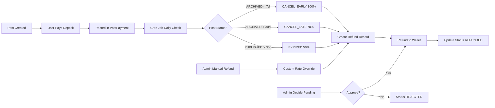

# PR #269: Refunds Module - Tài liệu mô tả

## 📋 Thông tin Pull Request

- **Branch**: `feat/backend/api-refund-policy`
- **Target**: `main`
- **Author**: @UGing265 (MShiroru Thai)
- **Trạng thái**: OPEN ✅
- **Build Status**: SUCCESS ✅
- **Quality Gate**: PASSED ✅

## 🎯 Tổng quan

PR này triển khai **Refunds Module** - module hoàn tiền tự động và thủ công cho các khoản đặt cọc (deposit) khi tạo bài đăng trong hệ thống EV Battery Trading Platform.

### Mục tiêu chính:
- ✅ **Hoàn tiền tự động** thông qua cron job chạy hàng ngày
- ✅ **Hoàn tiền thủ công** với workflow phê duyệt của admin
- ✅ **Chế độ preview** (dry run) trước khi thực thi
- ✅ **Phát hiện gian lận** với tỷ lệ hoàn 0%
- ✅ **Audit trail đầy đủ** với wallet transactions

---

## 🏗️ Kiến trúc hệ thống

### Sơ đồ luồng hoạt động



### Database Schema

**Bảng `refunds`:**
```sql
refunds
├── id (bigint PK) - ID tự tăng
├── post_id (bigint FK → posts)
├── account_id (int FK → accounts)
├── scenario (enum) - Loại refund
├── policy_rate_percent (smallint) - Tỷ lệ % (0-100)
├── amount_original (numeric) - Số tiền gốc
├── amount_refund (numeric) - Số tiền hoàn thực tế
├── status (enum) - Trạng thái
├── reason (varchar) - Lý do
├── held_until (timestamptz) - Thời gian giữ
├── wallet_transaction_id (int FK)
├── refunded_at (timestamptz)
├── created_at (timestamptz)
└── updated_at (timestamptz)
```

### Enums

**RefundScenario:**
```typescript
CANCEL_EARLY      // Hủy sớm < 7 ngày → 100%
CANCEL_LATE       // Hủy trễ 7-30 ngày → 70%
EXPIRED           // Hết hạn > 30 ngày → 50%
FRAUD_SUSPECTED   // Gian lận → 0%
```

**RefundStatus:**
```typescript
PENDING    // Chờ phê duyệt
REFUNDED   // Đã hoàn tiền
REJECTED   // Bị từ chối
FAILED     // Thất bại
```

---

## 📂 Cấu trúc file thay đổi

### Configuration (2 files)
- **app.module.ts**: Đăng ký `ScheduleModule` và `RefundsModule`
- **refunds.module.ts**: Cấu hình module với dependencies

### Core Implementation (19 files)

#### Refunds Module
- **refunds.controller.ts** (+149 lines): API endpoints cho refund management
- **refunds.service.ts** (+316 lines): Business logic và approval workflow
- **refunds-cron.service.ts** (+280 lines): Cron job tự động hoàn tiền
- **refund.entity.ts** (+110 lines): Entity với 13 fields

#### DTOs
- **manual-refund.dto.ts**: Request DTO cho manual refund
- **admin-decide-refund.dto.ts**: DTO cho approve/reject
- **refund-response.dto.ts**: 5 response DTOs khác nhau
- **refund-request.dto.ts**: DTO cho refund request
- **create-refund.dto.ts**: Placeholder
- **update-refund.dto.ts**: Placeholder

#### Enums
- **refund-scenario.enum.ts**: 4 scenarios
- **refund-status.enum.ts**: 4 statuses

#### Integration Points
- **posts.controller.ts** (+27 lines): Thêm endpoint `POST recall`
- **posts.service.ts** (+23 lines): Method `recallMyPostById()`
- **transactions.controller.ts** (+60 lines): Endpoints cho post deposit
- **transactions.service.ts** (+68 lines): Post deposit payment tracking
- **wallets.service.ts** (+51 lines): Method `refund()` cho wallet topup
- **refund-policy.entity.ts** (+11 lines): Thêm `cancelLateRate` field

### Documentation (1 file)
- **CRON_JOB_README.md** (+214 lines): Tài liệu chi tiết về cron job

### Dependencies (2 files)
- **package.json**: Thêm `@nestjs/schedule@^6.0.1`
- **pnpm-lock.yaml**: Update với schedule và cron dependencies

### Bug Fix (1 file)
- **post-lifecycle.controller.ts**: Xóa admin role restriction từ GET endpoint

---

## 🔄 Luồng hoạt động chi tiết

### 1. Automatic Refund (Cron Job)

**Schedule**: Mỗi phút (cần đổi sang daily at midnight)
**Timezone**: Asia/Ho_Chi_Minh

**Logic:**
```typescript
Mỗi ngày 00:00
  ↓
Tìm posts có reviewedAt
  ↓
Tính số ngày từ khi reviewed
  ↓
Xác định scenario:
  - ARCHIVED + < 7 ngày → CANCEL_EARLY (100%)
  - ARCHIVED + 7-30 ngày → CANCEL_LATE (70%)
  - PUBLISHED + > 30 ngày → EXPIRED (50%)
  ↓
Lấy deposit từ post_payments
  ↓
Tính refund = deposit × (rate / 100)
  ↓
Tạo Refund record (PENDING)
  ↓
Gọi walletsService.refund()
  ↓
Update status → REFUNDED
```

### 2. Manual Refund Workflow

```typescript
Admin: POST /refunds/manual
  ↓
Validate post và post_payment
  ↓
Check đã refund chưa
  ↓
Tính scenario (hoặc admin chọn)
  ↓
Lấy rate (từ custom hoặc policy)
  ↓
DRY RUN?
  ├─ Yes → Return preview only
  └─ No → Create PENDING refund
         ↓
         Admin: GET /refunds/pending
         ↓
         Admin: POST /refunds/:id/decide
         ├─ approve → walletsService.refund() → REFUNDED
         └─ reject → No wallet change → REJECTED
```

### 3. Post Recall (User initiated)

```typescript
User: PATCH /posts/:id/recall
  ↓
Validate ownership
  ↓
Check status (must not be ARCHIVED)
  ↓
Set status → ARCHIVED
  ↓
Cron job picks up (if within refund window)
  ↓
Auto refund based on days
```

---

## 🛠️ API Endpoints

### 1. GET /refunds
**Auth**: Admin  
**Description**: Lấy tất cả refunds  
**Response**: `RefundResponseDto[]`

### 2. GET /refunds/pending
**Auth**: Admin  
**Description**: Lấy refunds đang chờ phê duyệt  
**Response**: `RefundResponseDto[]`

### 3. POST /refunds/manual
**Auth**: Admin  
**Description**: Tạo manual refund request  
**Body**:
```json
{
  "postId": "123",
  "scenario": "FRAUD_SUSPECTED",
  "customRate": 0,
  "reason": "User tạo post giả",
  "dryRun": false
}
```
**Response**: `ManualRefundResponseDto` hoặc `DryRunResponseDto`

**Features**:
- `dryRun: true` → Preview only, không lưu DB
- `dryRun: false` → Tạo refund với status PENDING
- Hỗ trợ custom rate override
- Admin có thể chọn scenario

### 4. POST /refunds/:id/decide
**Auth**: Admin  
**Description**: Phê duyệt hoặc từ chối refund  
**Body**:
```json
{
  "decision": "approve", // hoặc "reject"
  "adminNotes": "Verified with user"
}
```
**Response**: `AdminDecideRefundResponseDto`

**Logic**:
- `approve` → Thực hiện refund vào wallet → Status = REFUNDED
- `reject` → Không refund → Status = REJECTED

### 5. POST /refunds/cron/trigger-expired-refund
**Auth**: Admin  
**Description**: Manual trigger cron job (for testing)  
**Response**: `CronTriggerResponseDto`
```json
{
  "processed": 10,
  "success": 8,
  "failed": 2,
  "details": ["Post 123 refunded: 500000 VND", ...]
}
```

### 6. PATCH /posts/:id/recall
**Auth**: User (owner)  
**Description**: User thu hồi (archive) bài đăng của mình  
**Response**: `BasePostResponseDto`

**Use case**: User muốn hủy bài đăng để nhận refund

### 7. POST /transactions/post-deposit
**Auth**: Any (called by FE after payment)  
**Description**: Ghi nhận deposit payment  
**Body**:
```json
{
  "postId": "123",
  "accountId": 156,
  "amountPaid": "100000.00",
  "walletTransactionId": 5
}
```

### 8. GET /transactions/post-deposit/:postId
**Auth**: Any  
**Description**: Lấy thông tin deposit của post  

### 9. GET /transactions/post-deposit/:postId/status
**Auth**: Any  
**Description**: Check xem post đã trả deposit chưa  
**Response**:
```json
{
  "postId": "123",
  "hasDeposit": true
}
```

---

## 🔑 Business Rules

### Refund Rates

| Scenario | Rate | Trigger | Notes |
|----------|------|---------|-------|
| **CANCEL_EARLY** | 100% | Auto/Manual | Hủy sớm < 7 ngày |
| **CANCEL_LATE** | 70% | Auto/Manual | Hủy trễ 7-30 ngày |
| **EXPIRED** | 50% | Auto | Hết hạn > 30 ngày |
| **FRAUD_SUSPECTED** | 0% | Manual only | Gian lận |

### Conditions for Auto Refund

- ✅ Post có `reviewedAt` (đã được duyệt)
- ✅ Post status = `PUBLISHED` hoặc `ARCHIVED`
- ✅ Có `PostPayment` record trong `post_payments`
- ✅ Chưa có `Refund` record cho post đó
- ✅ Đủ điều kiện về thời gian:
  - ARCHIVED < 7 ngày → 100%
  - ARCHIVED 7-30 ngày → 70%
  - PUBLISHED > 30 ngày → 50%

### Wallet Transaction

Mỗi refund tạo 1 wallet transaction với:
- `service_type_id = 3` (DEPOSIT_REFUND)
- `related_entity_type = 'refunds'`
- `related_entity_id = refund.id`
- `description` = Mô tả chi tiết refund

---

## 🐛 Issues & Fixes từ Review Comments

### Critical Issues

1. **❌ Cron schedule sai**
   - **Issue**: Đang chạy `EVERY_MINUTE` thay vì daily
   - **Impact**: Performance degradation, duplicate processing
   - **Fix**: Đổi sang `CronExpression.EVERY_DAY_AT_MIDNIGHT`

2. **⚠️ Conflict routing**
   - **Issue**: `/post-deposit/:postId` và `/post-deposit/:postId/status` conflict
   - **Fix**: Đổi thành `/post-deposit-status/:postId`

3. **⚠️ Missing idempotency**
   - **Issue**: Approve refund có thể bị double-refund khi retry
   - **Fix**: Dùng unique key `APPROVE-${refund.id}` thay vì `refund.id`

### Medium Issues

4. **Query optimization**
   - **Issue**: Fetch all posts rồi mới filter
   - **Suggestion**: Add date-based filtering trong query

5. **Inconsistent workflow**
   - **Issue**: Cron auto-approve, manual cần approval
   - **Suggestion**: Document rõ lý do (cron theo policy, manual là special case)

### Minor Issues

6. **Console.log trong production**
   - Thay bằng logger service hoặc xóa

7. **Unused imports**
   - `PaymentOrder` trong module nhưng không dùng

8. **Documentation mismatch**
   - Docs nói 80% nhưng code là 50% cho EXPIRED
   - Docs nói PaymentOrder nhưng code dùng PostPayment

---

## ✅ Testing Checklist

### Manual Testing

- [x] **Dry Run**: Test calculation preview
  ```bash
  POST /refunds/manual
  { "postId": "75", "dryRun": true, "reason": "Test" }
  ```

- [x] **Create PENDING**: Verify không refund ngay
  ```bash
  POST /refunds/manual
  { "postId": "75", "reason": "Manual request", "dryRun": false }
  ```

- [x] **Review Pending**: Check refund xuất hiện
  ```bash
  GET /refunds/pending
  ```

- [x] **Approve**: Verify wallet credit + status change
  ```bash
  POST /refunds/10/decide
  { "decision": "approve" }
  ```

- [x] **Check Wallet**: Verify transaction created
  ```sql
  SELECT * FROM wallet_transactions 
  WHERE service_type_id = 3 AND related_entity_id = 10;
  ```

- [x] **Trigger Cron**: Test automatic refunds
  ```bash
  POST /refunds/cron/trigger-expired-refund
  ```

### Expected Results

- Dry run trả về calculation, không lưu DB
- Manual refund tạo PENDING (không phải REFUNDED)
- Approve tạo wallet_transaction với service_type_id=3
- Reject set status=REJECTED, không thay đổi wallet
- Cron xử lý posts đủ điều kiện dựa trên reviewedAt

---

## 📊 Code Statistics

- **Total files changed**: 26 files
- **Total additions**: ~2,400 lines
- **Total deletions**: ~50 lines

### Breakdown:
- **API Layer**: 3 controllers
- **Service Layer**: 3 services (main, cron, integration)
- **Data Layer**: 2 entities, 1 entity update
- **DTOs**: 7 DTOs
- **Enums**: 2 enums
- **Documentation**: 2 markdown files
- **Dependencies**: 1 new package

---

## 🔮 Future Improvements

### Short Term
1. Email notifications khi refund xong
2. Batch approval cho nhiều PENDING refunds
3. Refund history per user
4. Admin dashboard monitoring

### Long Term
1. User-initiated refund requests
2. ML-based fraud detection
3. Partial refunds (custom amounts)
4. Refund scheduling
5. Multi-tier approval workflow

---

## 🔗 Related Documentation

- **Main Module**: `ai-prompt/thaiF15/refunds-api.md`
- **Cron Job**: `ai-prompt/thaiF15/CRON_JOB_README.md`
- **Conversation Log**: `ai-prompt/thaiF15/refunds-conversation.md`
- **Swagger**: `/api/docs` endpoint
- **GitHub PR**: https://github.com/lgdlong/g3-swp391-2hand-ev-battery-trading/pull/269

---

## 👥 Contributors

- **Author**: @UGing265 (MShiroru Thai)
- **Reviewers**: Copilot PR Reviewer, SonarCloud, Qodo Merge Pro
- **AI Assistant**: GitHub Copilot

---

## 📝 Notes

- PR đang ở trạng thái OPEN, chưa merge vào main
- Build thành công, Quality Gate passed
- Có 8 new issues từ SonarCloud (cần review)
- Có 25 comments từ automated reviewers
- Cần fix cron schedule trước khi deploy production

---

**Last Updated**: 2025-11-08  
**Document By**: GitHub Copilot  
**Version**: 1.0
