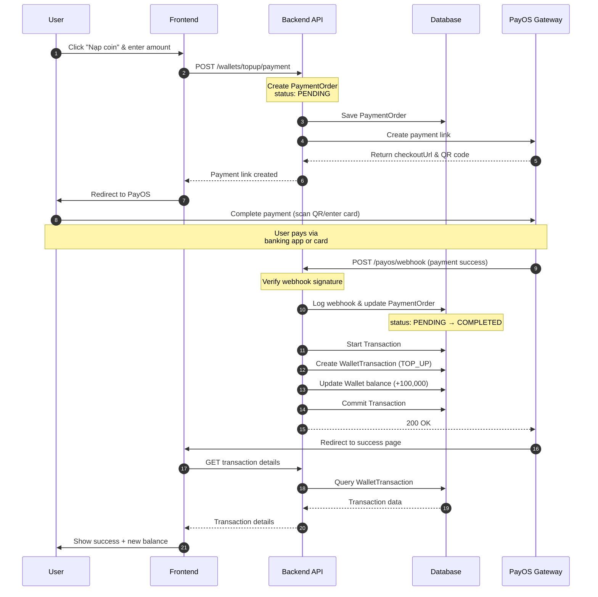
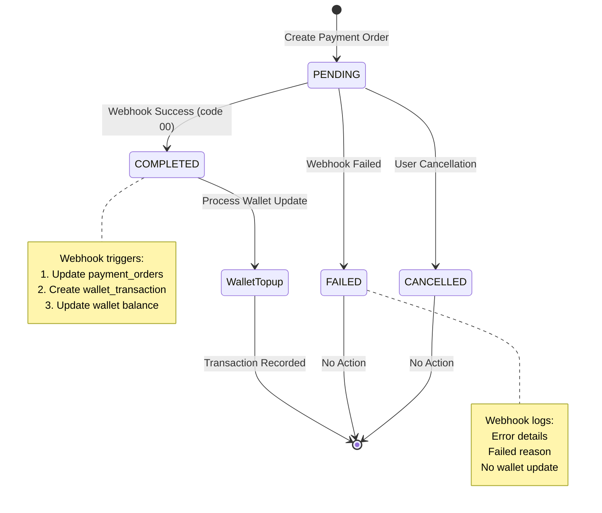

# Wallet Topup Feature - Detailed Flow Documentation

## Overview

The wallet topup feature enables users to add funds to their digital wallet using PayOS payment gateway. The system handles payment processing, webhook notifications, and automatic wallet balance updates.

## System Architecture

### Tech Stack
- **Frontend**: Next.js 15 (App Router), React Query, TypeScript
- **Backend**: NestJS, TypeORM, PostgreSQL
- **Payment Gateway**: PayOS
- **Database**: PostgreSQL with transaction support

### Key Components
- **Frontend**: `TopupModal.tsx`, `/checkout/result` page
- **Backend Services**: `WalletsService`, `PayosService`
- **Controllers**: `WalletsController`, `PayosController`
- **Entities**: `Wallet`, `WalletTransaction`, `PaymentOrder`, `PayosWebhookLog`

---

## Detailed Sequence Diagram



---

## Database Schema

### Tables Involved

#### 1. `payment_orders`
Stores payment order records for all payment types.

```sql
CREATE TABLE payment_orders (
  id BIGSERIAL PRIMARY KEY,
  account_id INT NOT NULL,
  service_type_id INT NOT NULL,
  order_code VARCHAR(50),
  amount DECIMAL(14,2) NOT NULL,
  status VARCHAR(20) DEFAULT 'PENDING', -- PENDING, COMPLETED, FAILED
  payable_id BIGINT,
  payable_type VARCHAR(50),
  payment_ref VARCHAR(255),
  paid_at TIMESTAMP,
  created_at TIMESTAMP DEFAULT NOW(),
  FOREIGN KEY (account_id) REFERENCES accounts(id),
  FOREIGN KEY (service_type_id) REFERENCES service_types(id)
);
```

#### 2. `payos_webhook_logs`
Logs all webhook notifications from PayOS.

```sql
CREATE TABLE payos_webhook_logs (
  id BIGSERIAL PRIMARY KEY,
  payload JSONB NOT NULL,
  signature VARCHAR(255) NOT NULL,
  is_signature_valid BOOLEAN NOT NULL,
  order_code BIGINT NOT NULL,
  payment_link_id VARCHAR(100),
  transaction_ref VARCHAR(100),
  transaction_status VARCHAR(10),
  amount DECIMAL(14,0),
  processing_status VARCHAR(20) DEFAULT 'RECEIVED', -- RECEIVED, PROCESSED, FAILED
  processing_notes TEXT,
  transaction_time TIMESTAMP NOT NULL,
  received_at TIMESTAMP DEFAULT NOW(),
  FOREIGN KEY (order_code) REFERENCES payment_orders(id)
);
```

#### 3. `wallets`
Stores user wallet balances.

```sql
CREATE TABLE wallets (
  user_id INT PRIMARY KEY,
  balance DECIMAL(14,2) DEFAULT 0.00,
  created_at TIMESTAMP DEFAULT NOW(),
  updated_at TIMESTAMP DEFAULT NOW(),
  FOREIGN KEY (user_id) REFERENCES accounts(id)
);
```

#### 4. `wallet_transactions`
Records all wallet transactions (topup, payment, refund, etc.).

```sql
CREATE TABLE wallet_transactions (
  id BIGSERIAL PRIMARY KEY,
  wallet_user_id INT NOT NULL,
  amount DECIMAL(14,2) NOT NULL,
  service_type_id INT NOT NULL,
  description TEXT,
  related_entity_type VARCHAR(100), -- 'payment_orders', 'posts', etc.
  related_entity_id BIGINT,
  created_at TIMESTAMP DEFAULT NOW(),
  FOREIGN KEY (wallet_user_id) REFERENCES wallets(user_id),
  FOREIGN KEY (service_type_id) REFERENCES service_types(id)
);
```

#### 5. `service_types`
Defines service types for payments and transactions.

```sql
CREATE TABLE service_types (
  id SERIAL PRIMARY KEY,
  code VARCHAR(50) UNIQUE NOT NULL, -- 'WALLET_TOPUP', 'POST_PAYMENT', etc.
  name VARCHAR(100) NOT NULL,
  description TEXT,
  created_at TIMESTAMP DEFAULT NOW()
);
```

---

## API Endpoints

### 1. Create Topup Payment
**Endpoint**: `POST /wallets/topup/payment`

**Headers**:
```
Authorization: Bearer <jwt_token>
Content-Type: application/json
```

**Request Body**:
```json
{
  "amount": 100000,
  "returnUrl": "https://yoursite.com/checkout/result",
  "cancelUrl": "https://yoursite.com/wallet"
}
```

**Response** (201 Created):
```json
{
  "error": 0,
  "message": "Success",
  "data": {
    "bin": "970422",
    "accountNumber": "1234567890",
    "accountName": "SHOP NAME",
    "amount": 100000,
    "description": "Nap tien vao vi",
    "orderCode": 123456,
    "currency": "VND",
    "paymentLinkId": "abcd1234-efgh-5678-ijkl-9012mnop3456",
    "status": "PENDING",
    "checkoutUrl": "https://pay.payos.vn/web/abcd1234",
    "qrCode": "00020101021238530010A000000727012600069704220..."
  }
}
```

### 2. PayOS Webhook Handler
**Endpoint**: `POST /payos/webhook`

**Headers**:
```
Content-Type: application/json
x-payos-signature: <webhook_signature>
```

**Request Body**:
```json
{
  "code": "00",
  "desc": "Thành công",
  "data": {
    "orderCode": 123456,
    "amount": 100000,
    "description": "Nap tien vao vi",
    "accountNumber": "1234567890",
    "reference": "FT23123456789",
    "transactionDateTime": "2025-11-03T10:30:00.000Z",
    "paymentLinkId": "abcd1234-efgh-5678-ijkl-9012mnop3456",
    "code": "00",
    "desc": "Thành công",
    "counterAccountBankId": "",
    "counterAccountBankName": "Vietcombank",
    "counterAccountName": "NGUYEN VAN A",
    "counterAccountNumber": "9876543210",
    "virtualAccountName": null,
    "virtualAccountNumber": null
  },
  "signature": "a1b2c3d4e5f6..."
}
```

**Response** (200 OK):
```json
{
  "message": "Webhook processed successfully"
}
```

### 3. Get Transaction by Order Code
**Endpoint**: `GET /wallets/transactions/by-order-code/:orderCode`

**Headers**:
```
Authorization: Bearer <jwt_token>
```

**Response** (200 OK):
```json
{
  "id": 789,
  "amount": "100000.00",
  "serviceType": {
    "id": 1,
    "code": "WALLET_TOPUP",
    "name": "Nạp tiền vào ví",
    "description": "Nạp tiền vào ví qua PayOS"
  },
  "description": "Nạp tiền từ PayOS - Order #123456",
  "relatedEntityType": "payment_orders",
  "relatedEntityId": "123456",
  "createdAt": "2025-11-03T10:30:15.000Z",
  "wallet": {
    "userId": 42,
    "balance": "150000.00",
    "createdAt": "2025-10-01T00:00:00.000Z",
    "updatedAt": "2025-11-03T10:30:15.000Z"
  }
}
```

---

## Frontend Components

### TopupModal.tsx
**Location**: `apps/web/components/TopupModal.tsx`

**Features**:
- Preset amount buttons (25k, 50k, 100k, 500k, 1M, 2M VND)
- Custom amount input with validation
- Real-time conversion display (VND → Coin)
- Minimum topup: 2,000 VND
- Loading state during payment creation
- Automatic redirect to PayOS checkout

**Key Functions**:
```typescript
const handleTopup = async () => {
  const response = await createTopupPayment({
    amount,
    returnUrl: `${window.location.origin}/checkout/result`,
    cancelUrl: `${window.location.origin}/wallet`,
  });
  
  if (response?.data?.checkoutUrl) {
    window.location.href = response.data.checkoutUrl;
  }
};
```

### Checkout Result Page
**Location**: `apps/web/app/(public)/checkout/result/page.tsx`

**Features**:
- Parse URL query parameters (orderCode, status, code)
- Fetch transaction details by orderCode
- Display success/failure message
- Show transaction details (amount, balance, timestamp)
- Navigation options (back to wallet, topup more)

**Query Parameters**:
- `orderCode`: Payment order ID
- `status`: Payment status (PAID, CANCELLED)
- `code`: Transaction code (00 = success)
- `cancel`: Cancel flag (true/false)

---

## Error Handling

### Frontend Errors

1. **Insufficient Amount**
   - Error: "Số tiền nạp tối thiểu là 2,000 ₫"
   - Trigger: Amount < 2,000 VND

2. **Payment Creation Failed**
   - Error: "Không thể tạo link thanh toán"
   - Trigger: API error or missing checkoutUrl

3. **Transaction Not Found**
   - Error: "Giao dịch không tồn tại hoặc bạn không có quyền truy cập"
   - Trigger: Invalid orderCode or unauthorized access

### Backend Errors

1. **Payment Order Not Found**
   - Status: 404 Not Found
   - Message: "Payment order not found: {paymentOrderId}"
   - Logged in webhook processing

2. **Wallet Topup Failed**
   - Logged but doesn't fail webhook processing
   - Error details saved in webhook log

3. **Database Transaction Failed**
   - Rollback all changes
   - Payment order remains PENDING
   - Retry mechanism via manual processing endpoint

---

## Security Features

### 1. HMAC Signature Verification
PayOS requests include HMAC-SHA256 signatures:

```typescript
private signcreate(createPayosDto: CreatePayosDto) {
  const str = `amount=${createPayosDto.amount}&cancelUrl=${createPayosDto.cancelUrl}&description=${createPayosDto.description}&orderCode=${createPayosDto.orderCode}&returnUrl=${createPayosDto.returnUrl}`;
  return createHmac('sha256', PAYOS_CHECKSUM_KEY)
    .update(str)
    .digest('hex');
}
```

### 2. JWT Authentication
All wallet endpoints require valid JWT token:
```typescript
@UseGuards(JwtAuthGuard)
@ApiBearerAuth()
```

### 3. Transaction Atomicity
Database operations use transactions to ensure data consistency:
```typescript
return this.dataSource.transaction(async (manager) => {
  // All DB operations are rolled back if any fails
  const wallet = await ensureWalletInTx(manager, userId);
  const transaction = await createTransaction(manager, data);
  const updatedWallet = await updateBalance(manager, wallet, amount);
  return { wallet: updatedWallet, transaction };
});
```

### 4. Webhook Logging
All webhook requests are logged for audit trail:
- Payload storage in JSONB
- Signature validation status
- Processing status tracking
- Error logging

---

## Payment Status Flow



---

## Transaction Flow States

### Payment Order States
- **PENDING**: Payment order created, awaiting PayOS confirmation
- **COMPLETED**: Payment successful, webhook received with code "00"
- **FAILED**: Payment failed or error occurred
- **CANCELLED**: User cancelled payment (not implemented yet)

### Webhook Processing States
- **RECEIVED**: Webhook received and logged
- **PROCESSED**: Webhook processed successfully
- **FAILED**: Webhook processing failed (retry possible)

### Wallet Transaction Types
- **TOP_UP**: Funds added to wallet (topup payment)
- **POST_PAYMENT**: Funds deducted for post listing fee
- **DEPOSIT_REFUND**: Refund of deposit
- **WITHDRAWAL**: Withdrawal from wallet (future feature)
- **ADJUSTMENT**: Admin manual adjustment

---

## Business Rules

### Topup Rules
1. **Minimum Amount**: 2,000 VND
2. **Maximum Amount**: No limit (but PayOS may have limits)
3. **Conversion Rate**: 1 VND = 1 Coin (1:1 ratio)
4. **Processing Time**: Usually instant (depends on PayOS)
5. **Wallet Creation**: Auto-created on first topup if not exists

### Transaction Rules
1. **Atomicity**: All wallet operations use database transactions
2. **Idempotency**: Webhook can be called multiple times (checking orderCode)
3. **Audit Trail**: All transactions logged with timestamp and reference
4. **Balance Validation**: Cannot have negative balance (enforced at DB level)

### Webhook Rules
1. **Retry Mechanism**: PayOS retries failed webhooks (exponential backoff)
2. **Duplicate Handling**: Check payment order status before processing
3. **Error Logging**: All webhook errors logged for investigation
4. **Timeout**: Webhook must respond within 10 seconds

---

## Testing Scenarios

### Happy Path
1. User opens TopupModal
2. Selects amount (e.g., 100,000 VND)
3. Clicks "Thanh toán"
4. Redirected to PayOS
5. Completes payment
6. Webhook updates payment status
7. Wallet balance increased
8. User redirected to success page

### Edge Cases

#### Case 1: Webhook Before User Return
- Webhook processes first
- Wallet updated
- User sees updated balance on return

#### Case 2: Multiple Webhook Calls
- First webhook: RECEIVED → PROCESSED
- Subsequent webhooks: Check status, skip if already COMPLETED

#### Case 3: Webhook Failure
- Webhook logged with FAILED status
- Admin can manually process via endpoint
- Payment order remains PENDING until processed

#### Case 4: User Closes Browser
- Payment may still complete
- Webhook processes normally
- User can check wallet later

### Error Scenarios

#### Invalid Amount
```
Input: 1000 VND
Expected: "Số tiền nạp tối thiểu là 2,000 ₫"
Result: Payment not created
```

#### Network Error
```
Scenario: API call fails
Expected: Error toast displayed
Result: User can retry
```

#### Invalid Order Code
```
Scenario: User manipulates URL
Expected: "Giao dịch không tồn tại"
Result: Show error page with back button
```

---

## Monitoring & Debugging

### Key Metrics
- **Payment Success Rate**: COMPLETED / (COMPLETED + FAILED)
- **Webhook Processing Time**: Time from received to processed
- **Average Topup Amount**: Total amount / number of topups
- **Failed Payments**: Count of FAILED status

### Debug Queries

#### Check Payment Status
```sql
SELECT id, order_code, amount, status, paid_at, created_at
FROM payment_orders
WHERE id = '123456';
```

#### Check Webhook Logs
```sql
SELECT order_code, transaction_status, processing_status, 
       processing_notes, received_at
FROM payos_webhook_logs
WHERE order_code = '123456'
ORDER BY received_at DESC;
```

#### Check Wallet Balance
```sql
SELECT w.user_id, w.balance, 
       COUNT(wt.id) as transaction_count,
       SUM(CASE WHEN wt.amount > 0 THEN wt.amount ELSE 0 END) as total_topup
FROM wallets w
LEFT JOIN wallet_transactions wt ON w.user_id = wt.wallet_user_id
WHERE w.user_id = 42
GROUP BY w.user_id, w.balance;
```

#### Check Failed Webhooks
```sql
SELECT order_code, processing_status, processing_notes, received_at
FROM payos_webhook_logs
WHERE processing_status = 'FAILED'
ORDER BY received_at DESC
LIMIT 10;
```

---

## Future Improvements

### Planned Features
1. **Webhook Signature Verification**: Implement PayOS signature validation
2. **Payment Retry**: Auto-retry failed payments
3. **Topup History**: Dedicated page for topup transactions
4. **Payment Cancellation**: Handle user-initiated cancellations
5. **Refund Support**: Process refunds for cancelled topups
6. **Notification System**: Email/SMS for successful topups
7. **Topup Bonuses**: Promotional bonuses for large topups
8. **Payment Methods**: Support multiple payment methods

### Technical Improvements
1. **Webhook Retry Queue**: Use job queue (Bull/BullMQ) for webhook processing
2. **Idempotency Keys**: Prevent duplicate topups
3. **Rate Limiting**: Prevent abuse of topup endpoint
4. **Analytics Dashboard**: Real-time topup metrics
5. **Load Testing**: Test webhook handling under high load

---

## Related Documentation

- [PayOS API Documentation](https://payos.vn/docs/api)
- [Wallet Management System](./wallet-management.md) *(to be created)*
- [Payment Integration Guide](./payment-integration.md) *(to be created)*
- [Error Handling Guidelines](./error-handling.md) *(to be created)*

---

## Glossary

- **orderCode**: Unique identifier for payment order (same as payment_orders.id)
- **paymentLinkId**: PayOS-generated payment link identifier
- **checkoutUrl**: URL to PayOS payment page
- **returnUrl**: URL to redirect after successful payment
- **cancelUrl**: URL to redirect if user cancels payment
- **webhook**: HTTP callback from PayOS with payment status
- **service_type**: Category of transaction (WALLET_TOPUP, POST_PAYMENT, etc.)
- **related_entity**: Reference to source entity (payment_order, post, etc.)

---

**Document Version**: 1.0  
**Last Updated**: November 3, 2025  
**Author**: Development Team  
**Status**: ✅ Completed & Reviewed
