# Post Creation Workflow - Khởi Tạo Bài Đăng

## Tổng Quan

Workflow tạo bài đăng là quy trình quan trọng nhất, bao gồm các bước: tạo draft → thanh toán phí → upload ảnh → publish. Hệ thống áp dụng **Fixed Fee** dựa trên **Fee Tiers** thay vì phí theo phần trăm.

## Luồng Hoạt Động Chi Tiết

```mermaid
sequenceDiagram
    participant User as 👤 User
    participant Web as 🌐 Frontend
    participant API as 🔧 API Backend
    participant Wallet as 💰 Wallet Service
    participant Post as 📝 Post Service
    participant DB as 🗄️ Database

    Note over User,DB: STEP 1: Tạo Draft Post (Status: DRAFT)

    User->>Web: Chọn loại post (EV_CAR/EV_BIKE/BATTERY)
    Web->>User: Hiển thị form tương ứng
    User->>Web: Điền thông tin post và submit
    
    Web->>API: POST /posts/draft {type, title, price, ...}
    API->>DB: INSERT INTO posts (status=DRAFT)
    DB-->>API: Return post ID
    API-->>Web: {postId, status: DRAFT}
    Web->>User: Redirect to /posts/create/payment/{postId}

    Note over User,DB: STEP 2: Thanh Toán Phí Đăng Bài

    Web->>API: GET /wallets/me
    API->>DB: SELECT * FROM wallets WHERE user_id = ?
    DB-->>API: {balance: "150000"}
    API-->>Web: Wallet data

    Web->>API: GET /settings/fee-tiers
    API->>DB: SELECT * FROM fee_tiers WHERE active = true
    DB-->>API: Fee tiers array
    API-->>Web: [{minPrice: 0, maxPrice: 10M, postingFee: 20000}, ...]

    Web->>Web: Calculate fee based on post price
    Note over Web: Find tier: minPrice <= postPrice <= maxPrice<br/>Fee = tier.postingFee (fixed amount)

    alt Số dư không đủ
        Web->>User: Show "Số dư không đủ" + button "Nạp tiền"
        User->>Web: Click "Nạp tiền"
        Web->>User: Open TopupModal
        Note over User,Wallet: User nạp tiền qua PayOS<br/>(Xem wallet-topup workflow)
        Web->>API: GET /wallets/me (refresh balance)
        API-->>Web: Updated wallet balance
    end

    User->>Web: Click "Thanh toán"
    Web->>API: POST /posts/pay-fee {postId, priceVnd}
    
    Note over API,DB: Transaction Service xử lý atomic
    
    API->>Wallet: processPostPayment(userId, postId, priceVnd)
    
    Wallet->>DB: Check if post already paid
    alt Đã thanh toán rồi
        DB-->>Wallet: Existing payment found
        Wallet-->>API: Error: "Bài đăng đã được thanh toán"
        API-->>Web: 400 Bad Request
        Web->>User: Show error toast
    end
    
    Wallet->>DB: Find applicable fee tier
    DB-->>Wallet: Fee tier data
    Wallet->>Wallet: Calculate: depositAmount = tier.postingFee
    
    Wallet->>DB: Check wallet balance
    DB-->>Wallet: Current balance
    
    alt Số dư không đủ
        Wallet-->>API: Error: "Số dư không đủ"
        API-->>Web: 400 Bad Request
        Web->>User: Show error + redirect to topup
    end
    
    Wallet->>DB: START TRANSACTION
    Wallet->>DB: UPDATE wallets SET balance = balance - depositAmount
    Wallet->>DB: INSERT INTO wallet_transactions<br/>(type=POST_PAYMENT, amount=-depositAmount)
    Wallet->>DB: INSERT INTO post_payments<br/>(postId, accountId, amountPaid, walletTransactionId)
    Wallet->>DB: COMMIT TRANSACTION
    
    DB-->>Wallet: Transaction success
    Wallet-->>API: {wallet, transaction, postPayment}
    API-->>Web: Payment success
    Web->>User: Show success toast + redirect to image upload

    Note over User,DB: STEP 3: Upload Ảnh

    User->>Web: Navigate to /posts/create/upload-images/{postId}
    Web->>API: GET /posts/{postId}
    API->>DB: SELECT * FROM posts WHERE id = ?
    DB-->>API: Post data (status should still be DRAFT)
    API-->>Web: Post details
    
    User->>Web: Select 5-10 images
    Web->>Web: Validate: 5 <= images.length <= 10
    
    loop For each image
        Web->>API: POST /posts/{postId}/images (FormData)
        API->>API: Upload to Cloudinary
        API->>DB: INSERT INTO post_images (postId, url, order)
        DB-->>API: Image saved
        API-->>Web: {url, id}
        Web->>User: Update progress bar
    end

    Note over User,DB: STEP 4: Publish Post

    User->>Web: Click "Hoàn tất"
    Web->>API: PATCH /posts/{postId}/publish
    
    API->>DB: SELECT * FROM posts WHERE id = ?
    DB-->>API: Post data
    
    API->>API: Validate:<br/>- Payment completed (post_payments exists)<br/>- Images uploaded (>= 5 images)<br/>- All required fields filled
    
    alt Validation fails
        API-->>Web: 400 Bad Request with error details
        Web->>User: Show validation errors
    end
    
    API->>DB: UPDATE posts<br/>SET status = 'PENDING_REVIEW'<br/>WHERE id = ?
    DB-->>API: Update success
    
    API-->>Web: {post, status: PENDING_REVIEW}
    Web->>User: Success message<br/>"Bài đăng đã được gửi. Chờ admin duyệt."
    Web->>User: Redirect to /posts/{postId}

    Note over User,DB: Bài đăng đang chờ admin duyệt
```



## Business Rules

### 1. Fee Calculation (Fixed Fee System)

**Fee Tiers Structure:**
```typescript
interface FeeTier {
  id: number;
  minPrice: number;        // VND
  maxPrice: number | null; // VND (null = unlimited)
  postingFee: number;      // Fixed fee amount (VND)
  active: boolean;
}
```

**Example Fee Tiers:**
| Min Price | Max Price | Posting Fee |
|-----------|-----------|-------------|
| 0 | 10,000,000 | 20,000 ₫ |
| 10,000,001 | 50,000,000 | 50,000 ₫ |
| 50,000,001 | null | 100,000 ₫ |

**Fee Calculation Logic:**
```typescript
// Find applicable tier
const tier = feeTiers.find(t => 
  postPrice >= t.minPrice && 
  (t.maxPrice === null || postPrice <= t.maxPrice)
);

const postingFee = tier.postingFee; // Fixed amount, NOT percentage
```

### 2. Payment Rules

- ✅ **Mandatory Payment**: User MUST pay before publishing
- ✅ **Atomic Transaction**: Wallet deduction + payment record creation trong 1 transaction
- ✅ **Idempotency**: Không thể thanh toán 2 lần cho cùng 1 post
- ✅ **Balance Check**: Phải có đủ số dư trước khi deduct
- ✅ **Topup Integration**: Tích hợp nút nạp tiền nếu thiếu tiền
- ❌ **Non-refundable**: Phí đăng bài KHÔNG hoàn lại (theo business model mới)

### 3. Post Status Transitions

```
DRAFT → (after payment) → DRAFT (still draft until publish)
      → (click publish) → PENDING_REVIEW
      → (admin approve) → PUBLISHED
      → (admin reject) → REJECTED
```

### 4. Validation Rules

**Draft Creation:**
- Required fields: `postType`, `title`, `priceVnd`, `description`, basic details
- No image upload required at this stage

**Payment Stage:**
- Must have valid draft post
- Post must not be already paid
- Wallet balance >= posting fee

**Image Upload:**
- Minimum 5 images, maximum 10 images
- Supported formats: JPG, PNG, WebP
- Max size per image: 5MB
- Upload to Cloudinary

**Publish Stage:**
- Payment completed (post_payments record exists)
- At least 5 images uploaded
- All required fields filled
- Status must be DRAFT

## API Endpoints

### 1. Create Draft Post

**Endpoint:** `POST /posts/draft`

**Request:**
```json
{
  "postType": "EV_CAR",
  "title": "Tesla Model 3 2020",
  "priceVnd": "850000000",
  "description": "Xe đẹp, chạy tốt",
  "carDetails": {
    "brandId": 1,
    "modelId": 5,
    "trimId": 12,
    "year": 2020,
    "batteryCapacityKwh": 75,
    "condition": "EXCELLENT"
  }
}
```

**Response:**
```json
{
  "id": "abc123",
  "postType": "EV_CAR",
  "status": "DRAFT",
  "title": "Tesla Model 3 2020",
  "priceVnd": "850000000",
  "seller": {
    "id": 42,
    "email": "user@example.com"
  },
  "createdAt": "2025-01-20T10:00:00Z"
}
```

### 2. Pay Post Fee

**Endpoint:** `POST /posts/pay-fee`

**Request:**
```json
{
  "postId": "abc123",
  "priceVnd": 850000000
}
```

**Response:**
```json
{
  "wallet": {
    "userId": 42,
    "balance": "130000"
  },
  "transaction": {
    "id": 789,
    "amount": "-20000",
    "serviceType": {
      "code": "POST_PAYMENT"
    },
    "description": "Phí đặt cọc đăng bài #abc123"
  },
  "postPayment": {
    "id": 1,
    "postId": "abc123",
    "accountId": 42,
    "amountPaid": "20000",
    "walletTransactionId": 789
  }
}
```

### 3. Upload Post Images

**Endpoint:** `POST /posts/{postId}/images`

**Request:** `multipart/form-data`
```
image: File
order: number (optional)
```

**Response:**
```json
{
  "id": "img_001",
  "url": "https://res.cloudinary.com/.../image.jpg",
  "postId": "abc123",
  "order": 1
}
```

### 4. Publish Post

**Endpoint:** `PATCH /posts/{postId}/publish`

**Response:**
```json
{
  "id": "abc123",
  "status": "PENDING_REVIEW",
  "title": "Tesla Model 3 2020",
  "priceVnd": "850000000",
  "images": [
    {
      "id": "img_001",
      "url": "https://...",
      "order": 1
    }
  ],
  "reviewedAt": null
}
```

## Error Handling

### Common Errors

**1. Insufficient Balance (400)**
```json
{
  "statusCode": 400,
  "message": "Số dư không đủ. Cần 20,000 ₫ để đăng bài.",
  "error": "Bad Request"
}
```

**2. Post Already Paid (400)**
```json
{
  "statusCode": 400,
  "message": "Bài đăng này đã được thanh toán rồi",
  "error": "Bad Request"
}
```

**3. Invalid Fee Tier (400)**
```json
{
  "statusCode": 400,
  "message": "Không tìm thấy bậc phí phù hợp với giá bài đăng",
  "error": "Bad Request"
}
```

**4. Missing Images (400)**
```json
{
  "statusCode": 400,
  "message": "Bài đăng cần ít nhất 5 ảnh",
  "error": "Bad Request"
}
```

## State Management (Frontend)

### React Query Keys

```typescript
// Post data
['post', postId]

// Wallet balance
['wallet', 'me']

// Fee tiers
['feeTiers']

// Payment check
['postPayment', 'check', postId]
```

### Invalidation Strategy

```typescript
// After payment success
queryClient.invalidateQueries({ queryKey: ['wallet', 'me'] });
queryClient.invalidateQueries({ queryKey: ['post', postId] });
queryClient.invalidateQueries({ queryKey: ['postPayment', 'check', postId] });

// After publish
queryClient.invalidateQueries({ queryKey: ['post', postId] });
queryClient.invalidateQueries({ queryKey: ['my-posts'] });
```

## Database Schema

### Tables Involved

**posts:**
- id (PK)
- post_type (enum)
- status (enum: DRAFT, PENDING_REVIEW, PUBLISHED, REJECTED)
- seller_id (FK → accounts)
- title, description, price_vnd
- created_at, updated_at, reviewed_at

**post_payments:**
- id (PK)
- post_id (FK → posts)
- account_id (FK → accounts)
- amount_paid (numeric)
- wallet_transaction_id (FK → wallet_transactions)
- created_at

**wallets:**
- user_id (PK, FK → accounts)
- balance (numeric)
- created_at, updated_at

**wallet_transactions:**
- id (PK)
- wallet_user_id (FK → wallets)
- amount (numeric, can be negative)
- service_type_id (FK → service_types)
- description (text)
- related_entity_type (text)
- related_entity_id (text)
- created_at

**fee_tiers:**
- id (PK)
- min_price (numeric)
- max_price (numeric, nullable)
- posting_fee (numeric) -- Fixed fee amount
- active (boolean)
- created_at, updated_at

## Testing Checklist

### Happy Path
- [ ] Create draft post successfully
- [ ] Calculate correct fee from tier
- [ ] Pay fee with sufficient balance
- [ ] Upload 5-10 images
- [ ] Publish and change status to PENDING_REVIEW

### Error Cases
- [ ] Insufficient balance → show topup modal
- [ ] Duplicate payment → error message
- [ ] Missing fee tier → error
- [ ] Upload < 5 images → validation error
- [ ] Publish without payment → error

### Edge Cases
- [ ] Concurrent payment attempts
- [ ] Wallet balance race conditions
- [ ] Network failures during upload
- [ ] Browser refresh during process

## Performance Considerations

1. **Database Transaction**: Use single transaction for payment
2. **Image Upload**: Parallel upload with progress tracking
3. **Query Caching**: Cache fee tiers and wallet balance
4. **Optimistic Updates**: Update UI before server confirms
5. **Error Recovery**: Retry failed image uploads

## Security Considerations

1. **Authorization**: Only post owner can pay and publish
2. **Idempotency**: Prevent double payment
3. **Input Validation**: Sanitize all user inputs
4. **SQL Injection**: Use parameterized queries
5. **File Upload**: Validate file types and sizes
