# Quy Trình Tạo Bài Đăng

## Tổng Quan

Quy trình tạo bài đăng là quy trình quan trọng nhất, bao gồm các bước: tạo bản nháp → thanh toán phí → tải ảnh lên → xuất bản. Hệ thống áp dụng **Phí cố định** dựa trên **Bậc phí** thay vì phí theo phần trăm.

## Luồng Hoạt Động Chi Tiết

```mermaid
sequenceDiagram
    participant User as 👤 Người dùng
    participant Web as 🌐 Giao diện
    participant API as 🔧 API Backend
    participant Wallet as 💰 Dịch vụ Ví
    participant Post as 📝 Dịch vụ Bài đăng
    participant DB as 🗄️ Cơ sở dữ liệu

    Note over User,DB: BƯỚC 1: Tạo Bản Nháp (Trạng thái: DRAFT)

    User->>Web: Chọn loại bài đăng (XE_ĐIỆN/XE_MÁY_ĐIỆN/PIN)
    Web->>User: Hiển thị biểu mẫu tương ứng
    User->>Web: Điền thông tin bài đăng và gửi
    
    Web->>API: POST /posts/draft {type, title, price, ...}
    API->>DB: INSERT INTO posts (status=DRAFT)
    DB-->>API: Trả về ID bài đăng
    API-->>Web: {postId, status: DRAFT}
    Web->>User: Chuyển hướng đến /posts/create/payment/{postId}

    Note over User,DB: BƯỚC 2: Thanh Toán Phí Đăng Bài

    Web->>API: GET /wallets/me
    API->>DB: SELECT * FROM wallets WHERE user_id = ?
    DB-->>API: {balance: "150000"}
    API-->>Web: Dữ liệu ví

    Web->>API: GET /settings/fee-tiers
    API->>DB: SELECT * FROM fee_tiers WHERE active = true
    DB-->>API: Mảng bậc phí
    API-->>Web: [{minPrice: 0, maxPrice: 10M, postingFee: 20000}, ...]

    Web->>Web: Tính phí dựa trên giá bài đăng
    Note over Web: Tìm bậc phí: minPrice <= postPrice <= maxPrice<br/>Phí = tier.postingFee (số tiền cố định)

    alt Số dư không đủ
        Web->>User: Hiển thị "Số dư không đủ" + nút "Nạp tiền"
        User->>Web: Nhấn "Nạp tiền"
        Web->>User: Mở TopupModal
        Note over User,Wallet: Người dùng nạp tiền qua PayOS<br/>(Xem quy trình nạp tiền vào ví)
        Web->>API: GET /wallets/me (làm mới số dư)
        API-->>Web: Số dư ví đã cập nhật
    end

    User->>Web: Nhấn "Thanh toán"
    Web->>API: POST /posts/pay-fee {postId, priceVnd}
    
    Note over API,DB: Dịch vụ Giao dịch xử lý nguyên tử
    
    API->>Wallet: processPostPayment(userId, postId, priceVnd)
    
    Wallet->>DB: Kiểm tra xem bài đăng đã thanh toán chưa
    alt Đã thanh toán rồi
        DB-->>Wallet: Tìm thấy thanh toán hiện có
        Wallet-->>API: Lỗi: "Bài đăng đã được thanh toán"
        API-->>Web: 400 Bad Request
        Web->>User: Hiển thị thông báo lỗi
    end
    
    Wallet->>DB: Tìm bậc phí phù hợp
    DB-->>Wallet: Dữ liệu bậc phí
    Wallet->>Wallet: Tính toán: depositAmount = tier.postingFee
    
    Wallet->>DB: Kiểm tra số dư ví
    DB-->>Wallet: Số dư hiện tại
    
    alt Số dư không đủ
        Wallet-->>API: Lỗi: "Số dư không đủ"
        API-->>Web: 400 Bad Request
        Web->>User: Hiển thị lỗi + chuyển hướng đến nạp tiền
    end
    
    Wallet->>DB: START TRANSACTION
    Wallet->>DB: UPDATE wallets SET balance = balance - depositAmount
    Wallet->>DB: INSERT INTO wallet_transactions<br/>(type=POST_PAYMENT, amount=-depositAmount)
    Wallet->>DB: INSERT INTO post_payments<br/>(postId, accountId, amountPaid, walletTransactionId)
    Wallet->>DB: COMMIT TRANSACTION
    
    DB-->>Wallet: Giao dịch thành công
    Wallet-->>API: {wallet, transaction, postPayment}
    API-->>Web: Thanh toán thành công
    Web->>User: Hiển thị thông báo thành công + chuyển đến tải ảnh

    Note over User,DB: BƯỚC 3: Tải Ảnh Lên

    User->>Web: Điều hướng đến /posts/create/upload-images/{postId}
    Web->>API: GET /posts/{postId}
    API->>DB: SELECT * FROM posts WHERE id = ?
    DB-->>API: Dữ liệu bài đăng (trạng thái vẫn là DRAFT)
    API-->>Web: Chi tiết bài đăng
    
    User->>Web: Chọn 5-10 ảnh
    Web->>Web: Xác thực: 5 <= images.length <= 10
    
    loop Với mỗi ảnh
        Web->>API: POST /posts/{postId}/images (FormData)
        API->>API: Tải lên Cloudinary
        API->>DB: INSERT INTO post_images (postId, url, order)
        DB-->>API: Ảnh đã lưu
        API-->>Web: {url, id}
        Web->>User: Cập nhật thanh tiến trình
    end

    Note over User,DB: BƯỚC 4: Xuất Bản Bài Đăng

    User->>Web: Nhấn "Hoàn tất"
    Web->>API: PATCH /posts/{postId}/publish
    
    API->>DB: SELECT * FROM posts WHERE id = ?
    DB-->>API: Dữ liệu bài đăng
    
    API->>API: Xác thực:<br/>- Đã thanh toán (tồn tại post_payments)<br/>- Đã tải ảnh (>= 5 ảnh)<br/>- Điền đủ các trường bắt buộc
    
    alt Xác thực thất bại
        API-->>Web: 400 Bad Request với chi tiết lỗi
        Web->>User: Hiển thị lỗi xác thực
    end
    
    API->>DB: UPDATE posts<br/>SET status = 'PENDING_REVIEW'<br/>WHERE id = ?
    DB-->>API: Cập nhật thành công
    
    API-->>Web: {post, status: PENDING_REVIEW}
    Web->>User: Thông báo thành công<br/>"Bài đăng đã được gửi. Chờ admin duyệt."
    Web->>User: Chuyển hướng đến /posts/{postId}

    Note over User,DB: Bài đăng đang chờ admin duyệt
```



## Quy Tắc Nghiệp Vụ

### 1. Tính Phí (Hệ Thống Phí Cố Định)

**Cấu trúc Bậc Phí:**
```typescript
interface FeeTier {
  id: number;
  minPrice: number;        // VND
  maxPrice: number | null; // VND (null = không giới hạn)
  postingFee: number;      // Số tiền phí cố định (VND)
  active: boolean;
}
```

**Ví dụ Bậc Phí:**
| Giá Tối Thiểu | Giá Tối Đa | Phí Đăng Bài |
|---------------|------------|--------------|
| 0 | 10,000,000 | 20,000 ₫ |
| 10,000,001 | 50,000,000 | 50,000 ₫ |
| 50,000,001 | null | 100,000 ₫ |

**Logic Tính Phí:**
```typescript
// Tìm bậc phí phù hợp
const tier = feeTiers.find(t => 
  postPrice >= t.minPrice && 
  (t.maxPrice === null || postPrice <= t.maxPrice)
);

const postingFee = tier.postingFee; // Số tiền cố định, KHÔNG phải phần trăm
```

### 2. Quy Tắc Thanh Toán

- ✅ **Thanh toán Bắt buộc**: Người dùng PHẢI thanh toán trước khi xuất bản
- ✅ **Giao dịch Nguyên tử**: Trừ tiền ví + tạo bản ghi thanh toán trong 1 giao dịch
- ✅ **Tính Idempotency**: Không thể thanh toán 2 lần cho cùng 1 bài đăng
- ✅ **Kiểm tra Số dư**: Phải có đủ số dư trước khi trừ tiền
- ✅ **Tích hợp Nạp tiền**: Tích hợp nút nạp tiền nếu thiếu tiền
- ❌ **Không hoàn tiền**: Phí đăng bài KHÔNG hoàn lại (theo mô hình kinh doanh mới)

### 3. Chuyển Đổi Trạng Thái Bài Đăng

```
DRAFT → (sau thanh toán) → DRAFT (vẫn là nháp cho đến khi xuất bản)
      → (nhấn xuất bản) → PENDING_REVIEW
      → (admin phê duyệt) → PUBLISHED
      → (admin từ chối) → REJECTED
```

### 4. Quy Tắc Xác Thực

**Tạo Bản Nháp:**
- Các trường bắt buộc: `postType`, `title`, `priceVnd`, `description`, thông tin cơ bản
- Không yêu cầu tải ảnh ở giai đoạn này

**Giai Đoạn Thanh Toán:**
- Phải có bài đăng nháp hợp lệ
- Bài đăng chưa được thanh toán
- Số dư ví >= phí đăng bài

**Tải Ảnh Lên:**
- Tối thiểu 5 ảnh, tối đa 10 ảnh
- Định dạng hỗ trợ: JPG, PNG, WebP
- Kích thước tối đa mỗi ảnh: 5MB
- Tải lên Cloudinary

**Giai Đoạn Xuất Bản:**
- Đã hoàn tất thanh toán (tồn tại bản ghi post_payments)
- Đã tải lên ít nhất 5 ảnh
- Điền đủ tất cả các trường bắt buộc
- Trạng thái phải là DRAFT

## API Endpoints

### 1. Tạo Bài Đăng Nháp

**Endpoint:** `POST /posts/draft`

**Request:**
```json
{
  "postType": "EV_CAR",
  "title": "Tesla Model 3 2020",
  "priceVnd": "850000000",
  "description": "Xe đẹp, chạy tốt",
  "carDetails": {
    "brandId": 1,
    "modelId": 5,
    "trimId": 12,
    "year": 2020,
    "batteryCapacityKwh": 75,
    "condition": "EXCELLENT"
  }
}
```

**Response:**
```json
{
  "id": "abc123",
  "postType": "EV_CAR",
  "status": "DRAFT",
  "title": "Tesla Model 3 2020",
  "priceVnd": "850000000",
  "seller": {
    "id": 42,
    "email": "user@example.com"
  },
  "createdAt": "2025-01-20T10:00:00Z"
}
```

### 2. Thanh Toán Phí Bài Đăng

**Endpoint:** `POST /posts/pay-fee`

**Request:**
```json
{
  "postId": "abc123",
  "priceVnd": 850000000
}
```

**Response:**
```json
{
  "wallet": {
    "userId": 42,
    "balance": "130000"
  },
  "transaction": {
    "id": 789,
    "amount": "-20000",
    "serviceType": {
      "code": "POST_PAYMENT"
    },
    "description": "Phí đặt cọc đăng bài #abc123"
  },
  "postPayment": {
    "id": 1,
    "postId": "abc123",
    "accountId": 42,
    "amountPaid": "20000",
    "walletTransactionId": 789
  }
}
```

### 3. Tải Ảnh Bài Đăng Lên

**Endpoint:** `POST /posts/{postId}/images`

**Request:** `multipart/form-data`
```
image: File
order: number (tùy chọn)
```

**Response:**
```json
{
  "id": "img_001",
  "url": "https://res.cloudinary.com/.../image.jpg",
  "postId": "abc123",
  "order": 1
}
```

### 4. Xuất Bản Bài Đăng

**Endpoint:** `PATCH /posts/{postId}/publish`

**Response:**
```json
{
  "id": "abc123",
  "status": "PENDING_REVIEW",
  "title": "Tesla Model 3 2020",
  "priceVnd": "850000000",
  "images": [
    {
      "id": "img_001",
      "url": "https://...",
      "order": 1
    }
  ],
  "reviewedAt": null
}
```

## Xử Lý Lỗi

### Các Lỗi Thường Gặp

**1. Số Dư Không Đủ (400)**
```json
{
  "statusCode": 400,
  "message": "Số dư không đủ. Cần 20,000 ₫ để đăng bài.",
  "error": "Bad Request"
}
```

**2. Bài Đăng Đã Thanh Toán (400)**
```json
{
  "statusCode": 400,
  "message": "Bài đăng này đã được thanh toán rồi",
  "error": "Bad Request"
}
```

**3. Không Tìm Thấy Bậc Phí (400)**
```json
{
  "statusCode": 400,
  "message": "Không tìm thấy bậc phí phù hợp với giá bài đăng",
  "error": "Bad Request"
}
```

**4. Thiếu Ảnh (400)**
```json
{
  "statusCode": 400,
  "message": "Bài đăng cần ít nhất 5 ảnh",
  "error": "Bad Request"
}
```

## Quản Lý Trạng Thái (Frontend)

### React Query Keys

```typescript
// Dữ liệu bài đăng
['post', postId]

// Số dư ví
['wallet', 'me']

// Bậc phí
['feeTiers']

// Kiểm tra thanh toán
['postPayment', 'check', postId]
```

### Chiến Lược Invalidation

```typescript
// Sau khi thanh toán thành công
queryClient.invalidateQueries({ queryKey: ['wallet', 'me'] });
queryClient.invalidateQueries({ queryKey: ['post', postId] });
queryClient.invalidateQueries({ queryKey: ['postPayment', 'check', postId] });

// Sau khi xuất bản
queryClient.invalidateQueries({ queryKey: ['post', postId] });
queryClient.invalidateQueries({ queryKey: ['my-posts'] });
```

## Lược Đồ Cơ Sở Dữ Liệu

### Các Bảng Liên Quan

**posts:**
- id (PK)
- post_type (enum)
- status (enum: DRAFT, PENDING_REVIEW, PUBLISHED, REJECTED)
- seller_id (FK → accounts)
- title, description, price_vnd
- created_at, updated_at, reviewed_at

**post_payments:**
- id (PK)
- post_id (FK → posts)
- account_id (FK → accounts)
- amount_paid (numeric)
- wallet_transaction_id (FK → wallet_transactions)
- created_at

**wallets:**
- user_id (PK, FK → accounts)
- balance (numeric)
- created_at, updated_at

**wallet_transactions:**
- id (PK)
- wallet_user_id (FK → wallets)
- amount (numeric, có thể âm)
- service_type_id (FK → service_types)
- description (text)
- related_entity_type (text)
- related_entity_id (text)
- created_at

**fee_tiers:**
- id (PK)
- min_price (numeric)
- max_price (numeric, nullable)
- posting_fee (numeric) -- Số tiền phí cố định
- active (boolean)
- created_at, updated_at

## Danh Sách Kiểm Tra

### Trường Hợp Thành Công
- [ ] Tạo bài đăng nháp thành công
- [ ] Tính phí chính xác từ bậc phí
- [ ] Thanh toán phí với số dư đủ
- [ ] Tải lên 5-10 ảnh
- [ ] Xuất bản và đổi trạng thái thành PENDING_REVIEW

### Trường Hợp Lỗi
- [ ] Số dư không đủ → hiển thị modal nạp tiền
- [ ] Thanh toán trùng lặp → thông báo lỗi
- [ ] Thiếu bậc phí → lỗi
- [ ] Tải lên < 5 ảnh → lỗi xác thực
- [ ] Xuất bản mà chưa thanh toán → lỗi

### Trường Hợp Đặc Biệt
- [ ] Các lần thanh toán đồng thời
- [ ] Race condition số dư ví
- [ ] Lỗi mạng khi tải ảnh
- [ ] Làm mới trình duyệt trong quá trình

## Cân Nhắc Hiệu Suất

1. **Giao dịch Cơ sở dữ liệu**: Sử dụng giao dịch đơn cho thanh toán
2. **Tải Ảnh**: Tải lên song song với theo dõi tiến trình
3. **Query Caching**: Cache bậc phí và số dư ví
4. **Optimistic Updates**: Cập nhật UI trước khi server xác nhận
5. **Khôi phục Lỗi**: Thử lại các lần tải ảnh thất bại

## Cân Nhắc Bảo Mật

1. **Ủy Quyền**: Chỉ chủ bài đăng mới có thể thanh toán và xuất bản
2. **Idempotency**: Ngăn chặn thanh toán kép
3. **Xác Thực Đầu Vào**: Làm sạch tất cả đầu vào người dùng
4. **SQL Injection**: Sử dụng truy vấn có tham số
5. **Tải Tệp**: Xác thực loại và kích thước tệp
