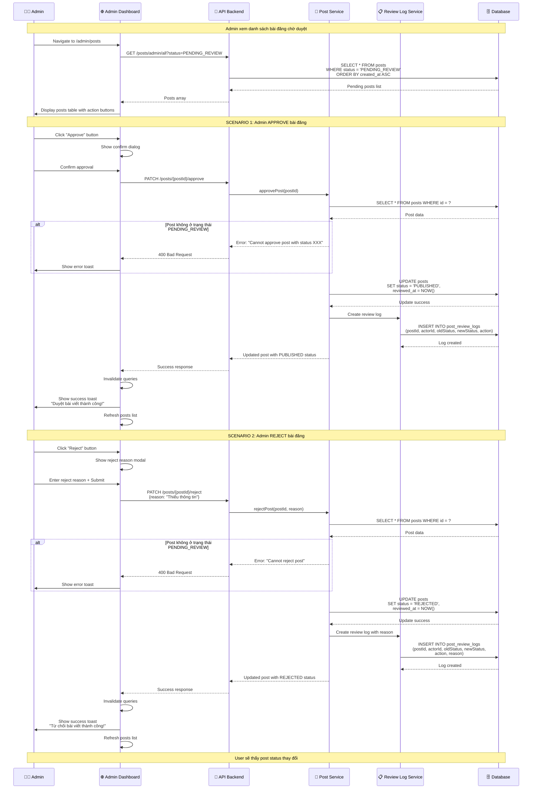
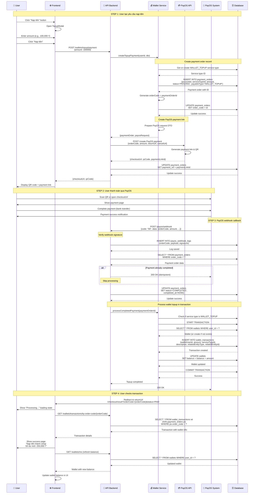

```mermaid
sequenceDiagram
    participant User as 👤 User (Seller)
    participant Web as 🌐 Frontend
    participant API as 🔧 API Backend
    participant Verify as ✅ Verification Service
    participant Wallet as 💰 Wallet Service
    participant DB as 🗄️ Database

    Note over User,DB: STEP 1: User yêu cầu kiểm định

    User->>Web: Navigate to /posts/{postId}
    Web->>API: GET /posts/{postId}
    API->>DB: SELECT * FROM posts WHERE id = ?
    DB-->>API: Post data (status=PUBLISHED)
    API-->>Web: Post details
    
    Web->>User: Show "Yêu cầu kiểm định" button<br/>(if status = PUBLISHED)
    
    User->>Web: Click "Yêu cầu kiểm định"
    Web->>Web: Show confirm dialog<br/>"Phí kiểm định: 50,000 ₫"
    User->>Web: Confirm
    
    Web->>API: POST /verify-post/{postId}/request
    API->>Verify: requestVerification(postId, userId)
    
    Verify->>DB: SELECT * FROM posts WHERE id = ?
    DB-->>Verify: Post data
    
    alt Post không phải PUBLISHED
        Verify-->>API: Error: "Only published posts can request verification"
        API-->>Web: 400 Bad Request
        Web->>User: Show error toast
    end
    
    Verify->>DB: Check existing verification request
    DB-->>Verify: Existing request (if any)
    
    alt Request đã tồn tại và APPROVED
        Verify-->>API: Error: "Post already verified"
        API-->>Web: 400 Bad Request
        Web->>User: Error: "Bài đăng đã được kiểm định"
    end
    
    alt Request đã tồn tại và PENDING
        Verify-->>API: Error: "Verification request pending"
        API-->>Web: 400 Bad Request
        Web->>User: Error: "Yêu cầu đang chờ duyệt"
    end
    
    Note over Verify,Wallet: Deduct verification fee from wallet
    
    Verify->>Wallet: deduct(userId, 50000, 'POST_VERIFICATION')
    Wallet->>DB: Check wallet balance
    
    alt Số dư không đủ
        Wallet-->>Verify: Error: "Insufficient balance"
        Verify-->>API: Error with message
        API-->>Web: 400 Bad Request
        Web->>User: "Số dư không đủ. Cần 50,000 ₫"
    end
    
    Wallet->>DB: START TRANSACTION
    Wallet->>DB: UPDATE wallets SET balance = balance - 50000
    Wallet->>DB: INSERT INTO wallet_transactions<br/>(amount=-50000, type=POST_VERIFICATION)
    Wallet->>DB: COMMIT TRANSACTION
    DB-->>Wallet: Transaction success
    Wallet-->>Verify: Wallet deducted
    
    Note over Verify,DB: Create verification request
    
    alt Request cũ đã bị REJECTED - cho phép request lại
        Verify->>DB: UPDATE post_verification_requests<br/>SET status='PENDING',<br/>    requested_at=NOW(),<br/>    reject_reason=NULL
    else New request
        Verify->>DB: INSERT INTO post_verification_requests<br/>(postId, requesterId, status='PENDING')
    end
    
    DB-->>Verify: Request created/updated
    Verify-->>API: Verification request DTO
    API-->>Web: Success response
    Web->>User: Success toast<br/>"Yêu cầu kiểm định đã được gửi"

    Note over User,DB: STEP 2: Admin xem và duyệt/từ chối

    participant Admin as 👨‍💼 Admin
    
    Admin->>Web: Navigate to /admin/posts (tab "Yêu cầu kiểm định")
    Web->>API: GET /verify-post/admin/pending
    API->>DB: SELECT * FROM post_verification_requests<br/>WHERE status = 'PENDING'
    DB-->>API: Pending verification requests
    API-->>Web: Requests list
    Web->>Admin: Display verification requests table

    Note over Admin,DB: SCENARIO A: Admin APPROVE verification

    Admin->>Web: Click "Approve" button
    Web->>Web: Show confirm dialog
    Admin->>Web: Confirm
    
    Web->>API: PATCH /verify-post/{postId}/approve
    API->>Verify: approveVerification(postId, adminId)
    
    Verify->>DB: SELECT * FROM post_verification_requests<br/>WHERE postId = ?
    DB-->>Verify: Verification request
    
    alt Request không PENDING
        Verify-->>API: Error: "Verification request is not pending"
        API-->>Web: 400 Bad Request
        Web->>Admin: Show error toast
    end
    
    Verify->>DB: START TRANSACTION
    Verify->>DB: UPDATE post_verification_requests<br/>SET status='APPROVED',<br/>    reviewed_at=NOW()
    Verify->>DB: UPDATE posts<br/>SET is_verified=true,<br/>    verified_at=NOW(),<br/>    verified_by_id={adminId}
    Verify->>DB: COMMIT TRANSACTION
    
    DB-->>Verify: Update success
    Verify-->>API: Updated verification request
    API-->>Web: Success response
    Web->>Admin: Success toast<br/>"Đã duyệt yêu cầu kiểm định"
    Web->>Web: Refresh requests list

    Note over Admin,DB: SCENARIO B: Admin REJECT verification

    Admin->>Web: Click "Reject" button
    Web->>Web: Show reject reason modal
    Admin->>Web: Enter reason + Submit
    
    Web->>API: PATCH /verify-post/{postId}/reject<br/>{rejectReason: "Thiếu giấy tờ"}
    API->>Verify: rejectVerification(postId, adminId, dto)
    
    Verify->>DB: SELECT * FROM post_verification_requests<br/>WHERE postId = ?
    DB-->>Verify: Verification request
    
    alt Request không PENDING
        Verify-->>API: Error: "Verification request is not pending"
        API-->>Web: 400 Bad Request
        Web->>Admin: Show error toast
    end
    
    Verify->>DB: UPDATE post_verification_requests<br/>SET status='REJECTED',<br/>    reviewed_at=NOW(),<br/>    reject_reason='{reason}'
    DB-->>Verify: Update success
    
    Verify-->>API: Updated verification request
    API-->>Web: Success response
    Web->>Admin: Success toast<br/>"Đã từ chối yêu cầu kiểm định"
    Web->>Web: Refresh requests list

    Note over User,DB: User có thể request lại nếu bị reject<br/>(sẽ mất thêm 50,000 ₫)
```

# Main Flow Workflow - Quy Trình Chính

## Tổng Quan

Main flow bao gồm các quy trình sau khi post được tạo: **Admin Review**, **Post Verification**, và **Wallet Topup via PayOS**. Đây là các workflow quan trọng nhất trong hệ thống.

---

## 1. Admin Review & Approval Workflow

Admin duyệt hoặc từ chối các bài đăng đang ở trạng thái `PENDING_REVIEW`.

### Sequence Diagram



### Business Rules

**Approval Rules:**
- ✅ Only `PENDING_REVIEW` posts can be approved
- ✅ Status changes: `PENDING_REVIEW` → `PUBLISHED`
- ✅ Set `reviewed_at` timestamp
- ✅ Create review log with action = `APPROVED`
- ✅ Post becomes visible to all users

**Rejection Rules:**
- ✅ Only `PENDING_REVIEW` posts can be rejected
- ✅ **Reject reason is REQUIRED**
- ✅ Status changes: `PENDING_REVIEW` → `REJECTED`
- ✅ Set `reviewed_at` timestamp
- ✅ Create review log with action = `REJECTED` and reason
- ❌ **NO REFUND** - Fees are non-refundable in new business model

### API Endpoints

**1. Get Pending Posts (Admin)**
```
GET /posts/admin/all?status=PENDING_REVIEW&limit=50&offset=0
Authorization: Bearer {admin_jwt}
```

**2. Approve Post (Admin)**
```
PATCH /posts/{postId}/approve
Authorization: Bearer {admin_jwt}

Response:
{
  "id": "abc123",
  "status": "PUBLISHED",
  "reviewedAt": "2025-01-20T14:30:00Z",
  ...
}
```

**3. Reject Post (Admin)**
```
PATCH /posts/{postId}/reject
Authorization: Bearer {admin_jwt}
Content-Type: application/json

{
  "reason": "Thiếu giấy tờ chứng minh nguồn gốc"
}

Response:
{
  "id": "abc123",
  "status": "REJECTED",
  "reviewedAt": "2025-01-20T14:30:00Z",
  ...
}
```

---

## 2. Post Verification Workflow

User yêu cầu kiểm định bài đăng (verified badge). Admin duyệt hoặc từ chối.

### Sequence Diagram



### Business Rules

**Verification Request Rules:**
- ✅ Only `PUBLISHED` posts can request verification
- ✅ **Fixed fee: 50,000 ₫** (deducted from wallet)
- ✅ Sufficient wallet balance required
- ❌ Cannot request if already `APPROVED`
- ❌ Cannot request if already `PENDING`
- ✅ **Can re-request if previously `REJECTED`** (pay again)

**Admin Approval Rules:**
- ✅ Only `PENDING` requests can be approved
- ✅ Update `post_verification_requests.status` → `APPROVED`
- ✅ Update `posts.is_verified` → `true`
- ✅ Set `verified_at` and `verified_by_id`
- ✅ Post gets "Đã kiểm định" badge

**Admin Rejection Rules:**
- ✅ Only `PENDING` requests can be rejected
- ✅ **Reject reason is REQUIRED**
- ✅ Update `post_verification_requests.status` → `REJECTED`
- ✅ Store `reject_reason`
- ❌ **NO REFUND** - Verification fee is non-refundable

### API Endpoints

**1. Request Verification (User)**
```
POST /verify-post/{postId}/request
Authorization: Bearer {user_jwt}

Response:
{
  "id": 1,
  "postId": "abc123",
  "requesterId": 42,
  "status": "PENDING",
  "requestedAt": "2025-01-20T15:00:00Z",
  "post": {...},
  "requester": {...}
}
```

**2. Get Pending Verification Requests (Admin)**
```
GET /verify-post/admin/pending
Authorization: Bearer {admin_jwt}

Response:
[
  {
    "id": 1,
    "postId": "abc123",
    "status": "PENDING",
    "post": {
      "title": "Tesla Model 3",
      ...
    },
    "requester": {
      "email": "user@example.com",
      ...
    }
  }
]
```

**3. Approve Verification (Admin)**
```
PATCH /verify-post/{postId}/approve
Authorization: Bearer {admin_jwt}

Response:
{
  "id": 1,
  "status": "APPROVED",
  "reviewedAt": "2025-01-20T16:00:00Z",
  ...
}
```

**4. Reject Verification (Admin)**
```
PATCH /verify-post/{postId}/reject
Authorization: Bearer {admin_jwt}
Content-Type: application/json

{
  "rejectReason": "Thiếu giấy tờ chứng minh nguồn gốc xe"
}

Response:
{
  "id": 1,
  "status": "REJECTED",
  "reviewedAt": "2025-01-20T16:00:00Z",
  "rejectReason": "Thiếu giấy tờ chứng minh nguồn gốc xe"
}
```

**5. Get Verification Fee**
```
GET /verify-post/fee
Authorization: Bearer {user_jwt}

Response:
{
  "fee": 50000
}
```

---

## 3. Wallet Topup via PayOS Workflow

User nạp tiền vào ví qua PayOS payment gateway.

### Sequence Diagram



### Business Rules

**Topup Request Rules:**
- ✅ Minimum amount: 1,000 ₫
- ✅ Maximum amount: Unlimited (configurable via PayOS)
- ✅ Create `payment_orders` record with status = `PENDING`
- ✅ Generate unique `orderCode` = `paymentOrderId`
- ✅ Set `payableType` = `WALLET_TOPUP`

**PayOS Integration Rules:**
- ✅ Use PayOS API to create payment link
- ✅ Store `paymentLinkId` in `payment_orders.payment_ref`
- ✅ Set `returnUrl` for success redirect
- ✅ Set `cancelUrl` for cancellation (optional)

**Webhook Processing Rules:**
- ✅ **Verify webhook signature** to prevent fraud
- ✅ **Idempotent processing** - skip if already completed
- ✅ Log all webhooks in `payos_webhook_logs`
- ✅ Update `payment_orders.status` → `COMPLETED`
- ✅ Process topup only if `code` = "00" (success)

**Wallet Topup Rules:**
- ✅ **Atomic transaction** for wallet update + transaction log
- ✅ Auto-create wallet if not exists
- ✅ Create `wallet_transactions` record (positive amount)
- ✅ Update `wallets.balance` += amount
- ✅ Link to `payment_orders` via `relatedEntityId`

### API Endpoints

**1. Create Topup Payment**
```
POST /wallets/topup/payment
Authorization: Bearer {user_jwt}
Content-Type: application/json

Request:
{
  "amount": 100000,
  "returnUrl": "http://localhost:3000/checkout/result",
  "cancelUrl": "http://localhost:3000/wallet"
}

Response:
{
  "code": "00",
  "desc": "success",
  "data": {
    "bin": "970422",
    "accountNumber": "113366668888",
    "accountName": "NGUYEN VAN A",
    "amount": 100000,
    "description": "Nap tien vao vi",
    "orderCode": 123456,
    "currency": "VND",
    "paymentLinkId": "abcd-1234-efgh-5678",
    "status": "PENDING",
    "checkoutUrl": "https://pay.payos.vn/web/abcd1234",
    "qrCode": "https://api.vieqr.com/img/..."
  }
}
```

**2. PayOS Webhook**
```
POST /payos/webhook
Content-Type: application/json
x-payos-signature: {signature}

Request:
{
  "code": "00",
  "desc": "Thành công",
  "data": {
    "orderCode": 123456,
    "amount": 100000,
    "description": "Nap tien vao vi",
    "accountNumber": "113366668888",
    "reference": "FT23123456789",
    "transactionDateTime": "2025-01-20T10:30:00.000Z",
    "paymentLinkId": "abcd-1234-efgh-5678",
    "code": "00",
    "desc": "Thành công",
    "counterAccountBankId": "",
    "counterAccountBankName": "Vietcombank",
    "counterAccountName": "NGUYEN VAN A",
    "counterAccountNumber": "9876543210"
  },
  "signature": "..."
}

Response:
200 OK
```

**3. Get Transaction by Order Code**
```
GET /wallets/transactions/by-order-code/{orderCode}
Authorization: Bearer {user_jwt}

Response:
{
  "id": 789,
  "amount": "100000.00",
  "serviceType": {
    "code": "WALLET_TOPUP",
    "name": "Nạp tiền vào ví"
  },
  "description": "Nạp tiền từ PayOS - Order #123456",
  "createdAt": "2025-01-20T10:30:15.000Z",
  "wallet": {
    "userId": 42,
    "balance": "250000.00"
  }
}
```

**4. Get My Wallet**
```
GET /wallets/me
Authorization: Bearer {user_jwt}

Response:
{
  "userId": 42,
  "balance": "250000.00",
  "createdAt": "2025-01-15T10:00:00Z",
  "updatedAt": "2025-01-20T10:30:15Z"
}
```

### Error Handling

**1. Insufficient Amount**
```json
{
  "statusCode": 400,
  "message": "Minimum top-up amount is 1,000 VND",
  "error": "Bad Request"
}
```

**2. PayOS API Error**
```json
{
  "statusCode": 500,
  "message": "Failed to create PayOS payment link",
  "error": "Internal Server Error"
}
```

**3. Invalid Webhook Signature**
```json
{
  "statusCode": 400,
  "message": "Invalid webhook signature",
  "error": "Bad Request"
}
```

**4. Payment Order Not Found**
```json
{
  "statusCode": 404,
  "message": "Payment order not found: 123456",
  "error": "Not Found"
}
```

### Security Considerations

1. **Webhook Signature Verification**: Validate PayOS signature to prevent fraud
2. **Idempotent Processing**: Handle duplicate webhooks gracefully
3. **Transaction Atomicity**: Use DB transactions for wallet updates
4. **HTTPS Only**: All PayOS communication must use HTTPS
5. **Environment Variables**: Store PayOS credentials securely

### Testing Checklist

**Happy Path:**
- [ ] Create topup payment successfully
- [ ] Receive PayOS payment link and QR
- [ ] Complete payment in PayOS
- [ ] Webhook received and processed
- [ ] Wallet balance updated correctly
- [ ] Transaction logged in database

**Error Cases:**
- [ ] Invalid amount (< 1000 ₫)
- [ ] PayOS API failure
- [ ] Invalid webhook signature
- [ ] Duplicate webhook (idempotency)
- [ ] Network timeout during payment
- [ ] User cancels payment

**Edge Cases:**
- [ ] Concurrent topup requests
- [ ] Wallet race conditions
- [ ] Webhook received before user redirect
- [ ] Multiple webhooks for same order

---

## Summary

### Main Flow Components

| Workflow | Status | Key Features |
|----------|--------|--------------|
| **Admin Review** | ✅ Implemented | Approve/Reject posts, Review logs, No refunds |
| **Post Verification** | ✅ Implemented | 50K ₫ fee, Wallet deduction, Admin approval, Re-request after reject |
| **Wallet Topup** | ✅ Implemented | PayOS integration, Webhook processing, Atomic transactions |

### Database Tables

**For Admin Review:**
- `posts` (status, reviewed_at)
- `post_review_logs` (action, reason)

**For Verification:**
- `post_verification_requests` (status, reject_reason)
- `posts` (is_verified, verified_at, verified_by_id)
- `wallet_transactions` (verification fee deduction)

**For Wallet Topup:**
- `payment_orders` (status, order_code, payment_ref)
- `payos_webhook_logs` (signature verification)
- `wallet_transactions` (topup amount)
- `wallets` (balance updates)

### Integration Points

- **Frontend**: React Query for state management, optimistic updates
- **Backend**: NestJS services with TypeORM transactions
- **PayOS**: REST API integration with webhook callbacks
- **Database**: PostgreSQL with ACID transactions
