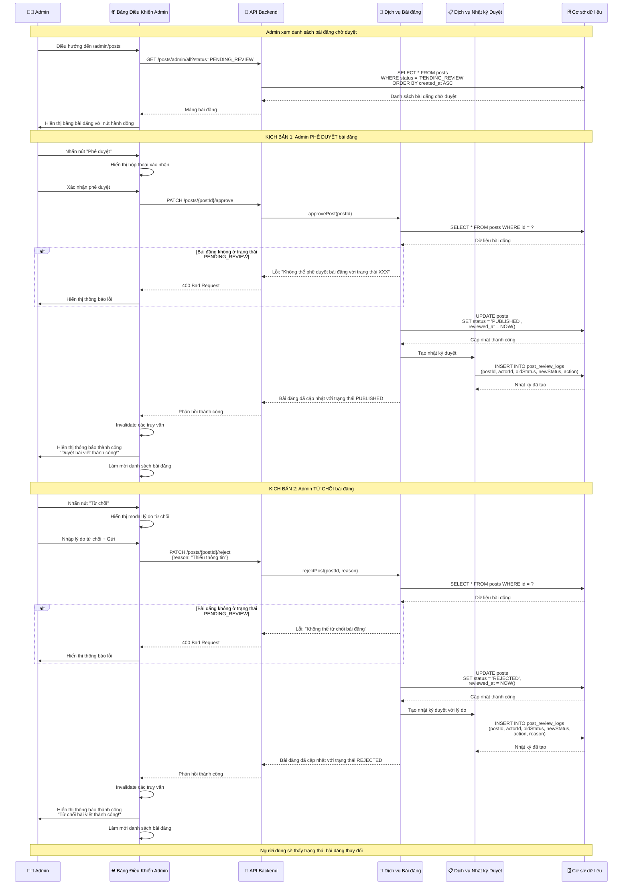
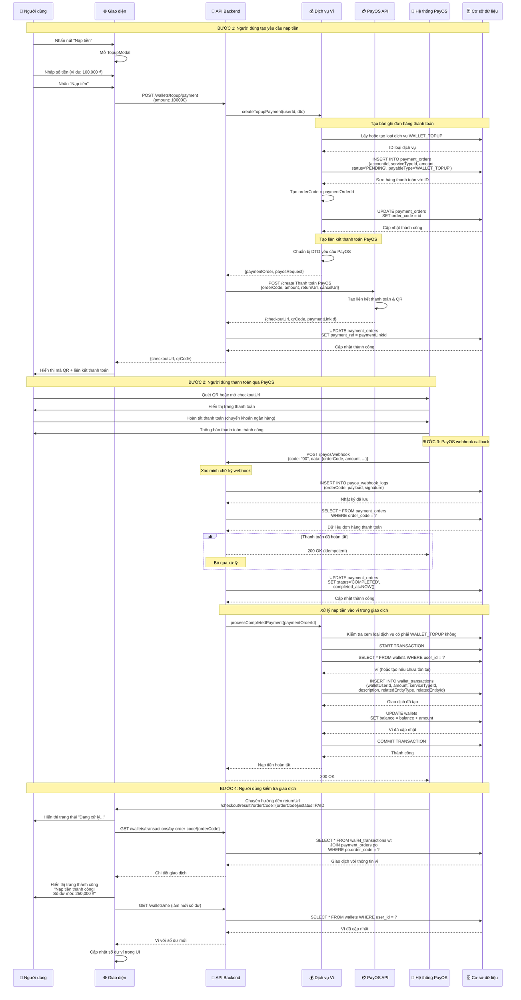

```mermaid
sequenceDiagram
    participant User as 👤 Người dùng (Người bán)
    participant Web as 🌐 Giao diện
    participant API as 🔧 API Backend
    participant Verify as ✅ Dịch vụ Kiểm định
    participant Wallet as 💰 Dịch vụ Ví
    participant DB as 🗄️ Cơ sở dữ liệu

    Note over User,DB: BƯỚC 1: Người dùng yêu cầu kiểm định

    User->>Web: Điều hướng đến /posts/{postId}
    Web->>API: GET /posts/{postId}
    API->>DB: SELECT * FROM posts WHERE id = ?
    DB-->>API: Dữ liệu bài đăng (status=PUBLISHED)
    API-->>Web: Chi tiết bài đăng
    
    Web->>User: Hiển thị nút "Yêu cầu kiểm định"<br/>(nếu status = PUBLISHED)
    
    User->>Web: Nhấn "Yêu cầu kiểm định"
    Web->>Web: Hiển thị hộp thoại xác nhận<br/>"Phí kiểm định: 50,000 ₫"
    User->>Web: Xác nhận
    
    Web->>API: POST /verify-post/{postId}/request
    API->>Verify: requestVerification(postId, userId)
    
    Verify->>DB: SELECT * FROM posts WHERE id = ?
    DB-->>Verify: Dữ liệu bài đăng
    
    alt Bài đăng không phải PUBLISHED
        Verify-->>API: Lỗi: "Chỉ bài đăng đã xuất bản mới có thể yêu cầu kiểm định"
        API-->>Web: 400 Bad Request
        Web->>User: Hiển thị thông báo lỗi
    end
    
    Verify->>DB: Kiểm tra yêu cầu kiểm định hiện có
    DB-->>Verify: Yêu cầu hiện có (nếu có)
    
    alt Yêu cầu đã tồn tại và APPROVED
        Verify-->>API: Lỗi: "Bài đăng đã được kiểm định"
        API-->>Web: 400 Bad Request
        Web->>User: Lỗi: "Bài đăng đã được kiểm định"
    end
    
    alt Yêu cầu đã tồn tại và PENDING
        Verify-->>API: Lỗi: "Yêu cầu kiểm định đang chờ duyệt"
        API-->>Web: 400 Bad Request
        Web->>User: Lỗi: "Yêu cầu đang chờ duyệt"
    end
    
    Note over Verify,Wallet: Trừ phí kiểm định từ ví
    
    Verify->>Wallet: deduct(userId, 50000, 'POST_VERIFICATION')
    Wallet->>DB: Kiểm tra số dư ví
    
    alt Số dư không đủ
        Wallet-->>Verify: Lỗi: "Số dư không đủ"
        Verify-->>API: Lỗi với thông báo
        API-->>Web: 400 Bad Request
        Web->>User: "Số dư không đủ. Cần 50,000 ₫"
    end
    
    Wallet->>DB: START TRANSACTION
    Wallet->>DB: UPDATE wallets SET balance = balance - 50000
    Wallet->>DB: INSERT INTO wallet_transactions<br/>(amount=-50000, type=POST_VERIFICATION)
    Wallet->>DB: COMMIT TRANSACTION
    DB-->>Wallet: Giao dịch thành công
    Wallet-->>Verify: Ví đã trừ tiền
    
    Note over Verify,DB: Tạo yêu cầu kiểm định
    
    alt Yêu cầu cũ đã bị REJECTED - cho phép yêu cầu lại
        Verify->>DB: UPDATE post_verification_requests<br/>SET status='PENDING',<br/>    requested_at=NOW(),<br/>    reject_reason=NULL
    else Yêu cầu mới
        Verify->>DB: INSERT INTO post_verification_requests<br/>(postId, requesterId, status='PENDING')
    end
    
    DB-->>Verify: Yêu cầu đã tạo/cập nhật
    Verify-->>API: DTO yêu cầu kiểm định
    API-->>Web: Phản hồi thành công
    Web->>User: Thông báo thành công<br/>"Yêu cầu kiểm định đã được gửi"

    Note over User,DB: BƯỚC 2: Admin xem và duyệt/từ chối

    participant Admin as 👨‍💼 Admin
    
    Admin->>Web: Điều hướng đến /admin/posts (tab "Yêu cầu kiểm định")
    Web->>API: GET /verify-post/admin/pending
    API->>DB: SELECT * FROM post_verification_requests<br/>WHERE status = 'PENDING'
    DB-->>API: Yêu cầu kiểm định chờ duyệt
    API-->>Web: Danh sách yêu cầu
    Web->>Admin: Hiển thị bảng yêu cầu kiểm định

    Note over Admin,DB: KỊCH BẢN A: Admin PHÊ DUYỆT kiểm định

    Admin->>Web: Nhấn nút "Phê duyệt"
    Web->>Web: Hiển thị hộp thoại xác nhận
    Admin->>Web: Xác nhận
    
    Web->>API: PATCH /verify-post/{postId}/approve
    API->>Verify: approveVerification(postId, adminId)
    
    Verify->>DB: SELECT * FROM post_verification_requests<br/>WHERE postId = ?
    DB-->>Verify: Yêu cầu kiểm định
    
    alt Yêu cầu không PENDING
        Verify-->>API: Lỗi: "Yêu cầu kiểm định không ở trạng thái chờ duyệt"
        API-->>Web: 400 Bad Request
        Web->>Admin: Hiển thị thông báo lỗi
    end
    
    Verify->>DB: START TRANSACTION
    Verify->>DB: UPDATE post_verification_requests<br/>SET status='APPROVED',<br/>    reviewed_at=NOW()
    Verify->>DB: UPDATE posts<br/>SET is_verified=true,<br/>    verified_at=NOW(),<br/>    verified_by_id={adminId}
    Verify->>DB: COMMIT TRANSACTION
    
    DB-->>Verify: Cập nhật thành công
    Verify-->>API: Yêu cầu kiểm định đã cập nhật
    API-->>Web: Phản hồi thành công
    Web->>Admin: Thông báo thành công<br/>"Đã duyệt yêu cầu kiểm định"
    Web->>Web: Làm mới danh sách yêu cầu

    Note over Admin,DB: KỊCH BẢN B: Admin TỪ CHỐI kiểm định

    Admin->>Web: Nhấn nút "Từ chối"
    Web->>Web: Hiển thị modal lý do từ chối
    Admin->>Web: Nhập lý do + Gửi
    
    Web->>API: PATCH /verify-post/{postId}/reject<br/>{rejectReason: "Thiếu giấy tờ"}
    API->>Verify: rejectVerification(postId, adminId, dto)
    
    Verify->>DB: SELECT * FROM post_verification_requests<br/>WHERE postId = ?
    DB-->>Verify: Yêu cầu kiểm định
    
    alt Yêu cầu không PENDING
        Verify-->>API: Lỗi: "Yêu cầu kiểm định không ở trạng thái chờ duyệt"
        API-->>Web: 400 Bad Request
        Web->>Admin: Hiển thị thông báo lỗi
    end
    
    Verify->>DB: UPDATE post_verification_requests<br/>SET status='REJECTED',<br/>    reviewed_at=NOW(),<br/>    reject_reason='{reason}'
    DB-->>Verify: Cập nhật thành công
    
    Verify-->>API: Yêu cầu kiểm định đã cập nhật
    API-->>Web: Phản hồi thành công
    Web->>Admin: Thông báo thành công<br/>"Đã từ chối yêu cầu kiểm định"
    Web->>Web: Làm mới danh sách yêu cầu

    Note over User,DB: Người dùng có thể yêu cầu lại nếu bị từ chối<br/>(sẽ mất thêm 50,000 ₫)
```

# Quy Trình Chính

## Tổng Quan

Quy trình chính bao gồm các quy trình sau khi bài đăng được tạo: **Duyệt Bài Admin**, **Kiểm Định Bài Đăng**, và **Nạp Tiền Vào Ví qua PayOS**. Đây là các quy trình quan trọng nhất trong hệ thống.

---

## 1. Quy Trình Duyệt và Phê Duyệt Bài Đăng của Admin

Admin duyệt hoặc từ chối các bài đăng đang ở trạng thái `PENDING_REVIEW`.

### Biểu Đồ Trình Tự



### Quy Tắc Nghiệp Vụ

**Quy Tắc Phê Duyệt:**
- ✅ Chỉ bài đăng `PENDING_REVIEW` mới có thể được phê duyệt
- ✅ Trạng thái chuyển đổi: `PENDING_REVIEW` → `PUBLISHED`
- ✅ Đặt timestamp `reviewed_at`
- ✅ Tạo nhật ký duyệt với action = `APPROVED`
- ✅ Bài đăng trở nên hiển thị với tất cả người dùng

**Quy Tắc Từ Chối:**
- ✅ Chỉ bài đăng `PENDING_REVIEW` mới có thể bị từ chối
- ✅ **Lý do từ chối là BẮT BUỘC**
- ✅ Trạng thái chuyển đổi: `PENDING_REVIEW` → `REJECTED`
- ✅ Đặt timestamp `reviewed_at`
- ✅ Tạo nhật ký duyệt với action = `REJECTED` và lý do
- ❌ **KHÔNG HOÀN TIỀN** - Phí không được hoàn lại trong mô hình kinh doanh mới

### API Endpoints

**1. Lấy Bài Đăng Chờ Duyệt (Admin)**
```
GET /posts/admin/all?status=PENDING_REVIEW&limit=50&offset=0
Authorization: Bearer {admin_jwt}
```

**2. Phê Duyệt Bài Đăng (Admin)**
```
PATCH /posts/{postId}/approve
Authorization: Bearer {admin_jwt}

Response:
{
  "id": "abc123",
  "status": "PUBLISHED",
  "reviewedAt": "2025-01-20T14:30:00Z",
  ...
}
```

**3. Từ Chối Bài Đăng (Admin)**
```
PATCH /posts/{postId}/reject
Authorization: Bearer {admin_jwt}
Content-Type: application/json

{
  "reason": "Thiếu giấy tờ chứng minh nguồn gốc"
}

Response:
{
  "id": "abc123",
  "status": "REJECTED",
  "reviewedAt": "2025-01-20T14:30:00Z",
  ...
}
```

---

## 2. Quy Trình Kiểm Định Bài Đăng

Người dùng yêu cầu kiểm định bài đăng (verified badge). Admin duyệt hoặc từ chối.

### Biểu Đồ Trình Tự



### Quy Tắc Nghiệp Vụ

**Quy Tắc Yêu Cầu Kiểm Định:**
- ✅ Chỉ bài đăng `PUBLISHED` mới có thể yêu cầu kiểm định
- ✅ **Phí cố định: 50,000 ₫** (trừ từ ví)
- ✅ Yêu cầu số dư ví đủ
- ❌ Không thể yêu cầu nếu đã `APPROVED`
- ❌ Không thể yêu cầu nếu đã `PENDING`
- ✅ **Có thể yêu cầu lại nếu trước đó bị `REJECTED`** (phải trả lại)

**Quy Tắc Phê Duyệt Admin:**
- ✅ Chỉ yêu cầu `PENDING` mới có thể được phê duyệt
- ✅ Cập nhật `post_verification_requests.status` → `APPROVED`
- ✅ Cập nhật `posts.is_verified` → `true`
- ✅ Đặt `verified_at` và `verified_by_id`
- ✅ Bài đăng nhận huy hiệu "Đã kiểm định"

**Quy Tắc Từ Chối Admin:**
- ✅ Chỉ yêu cầu `PENDING` mới có thể bị từ chối
- ✅ **Lý do từ chối là BẮT BUỘC**
- ✅ Cập nhật `post_verification_requests.status` → `REJECTED`
- ✅ Lưu `reject_reason`
- ❌ **KHÔNG HOÀN TIỀN** - Phí kiểm định không được hoàn lại

### API Endpoints

**1. Yêu Cầu Kiểm Định (Người dùng)**
```
POST /verify-post/{postId}/request
Authorization: Bearer {user_jwt}

Response:
{
  "id": 1,
  "postId": "abc123",
  "requesterId": 42,
  "status": "PENDING",
  "requestedAt": "2025-01-20T15:00:00Z",
  "post": {...},
  "requester": {...}
}
```

**2. Lấy Yêu Cầu Kiểm Định Chờ Duyệt (Admin)**
```
GET /verify-post/admin/pending
Authorization: Bearer {admin_jwt}

Response:
[
  {
    "id": 1,
    "postId": "abc123",
    "status": "PENDING",
    "post": {
      "title": "Tesla Model 3",
      ...
    },
    "requester": {
      "email": "user@example.com",
      ...
    }
  }
]
```

**3. Phê Duyệt Kiểm Định (Admin)**
```
PATCH /verify-post/{postId}/approve
Authorization: Bearer {admin_jwt}

Response:
{
  "id": 1,
  "status": "APPROVED",
  "reviewedAt": "2025-01-20T16:00:00Z",
  ...
}
```

**4. Từ Chối Kiểm Định (Admin)**
```
PATCH /verify-post/{postId}/reject
Authorization: Bearer {admin_jwt}
Content-Type: application/json

{
  "rejectReason": "Thiếu giấy tờ chứng minh nguồn gốc xe"
}

Response:
{
  "id": 1,
  "status": "REJECTED",
  "reviewedAt": "2025-01-20T16:00:00Z",
  "rejectReason": "Thiếu giấy tờ chứng minh nguồn gốc xe"
}
```

**5. Lấy Phí Kiểm Định**
```
GET /verify-post/fee
Authorization: Bearer {user_jwt}

Response:
{
  "fee": 50000
}
```

---

## 3. Quy Trình Nạp Tiền Vào Ví qua PayOS

Người dùng nạp tiền vào ví qua cổng thanh toán PayOS.

### Biểu Đồ Trình Tự



### Quy Tắc Nghiệp Vụ

**Quy Tắc Yêu Cầu Nạp Tiền:**
- ✅ Số tiền tối thiểu: 1,000 ₫
- ✅ Số tiền tối đa: Không giới hạn (có thể cấu hình qua PayOS)
- ✅ Tạo bản ghi `payment_orders` với status = `PENDING`
- ✅ Tạo `orderCode` duy nhất = `paymentOrderId`
- ✅ Đặt `payableType` = `WALLET_TOPUP`

**Quy Tắc Tích Hợp PayOS:**
- ✅ Sử dụng PayOS API để tạo liên kết thanh toán
- ✅ Lưu `paymentLinkId` trong `payment_orders.payment_ref`
- ✅ Đặt `returnUrl` cho chuyển hướng thành công
- ✅ Đặt `cancelUrl` cho hủy bỏ (tùy chọn)

**Quy Tắc Xử Lý Webhook:**
- ✅ **Xác minh chữ ký webhook** để ngăn chặn gian lận
- ✅ **Xử lý idempotent** - bỏ qua nếu đã hoàn tất
- ✅ Ghi lại tất cả webhook trong `payos_webhook_logs`
- ✅ Cập nhật `payment_orders.status` → `COMPLETED`
- ✅ Chỉ xử lý nạp tiền nếu `code` = "00" (thành công)

**Quy Tắc Nạp Tiền Vào Ví:**
- ✅ **Giao dịch nguyên tử** cho cập nhật ví + nhật ký giao dịch
- ✅ Tự động tạo ví nếu chưa tồn tại
- ✅ Tạo bản ghi `wallet_transactions` (số tiền dương)
- ✅ Cập nhật `wallets.balance` += amount
- ✅ Liên kết đến `payment_orders` qua `relatedEntityId`

### API Endpoints

**1. Tạo Thanh Toán Nạp Tiền**
```
POST /wallets/topup/payment
Authorization: Bearer {user_jwt}
Content-Type: application/json

Request:
{
  "amount": 100000,
  "returnUrl": "http://localhost:3000/checkout/result",
  "cancelUrl": "http://localhost:3000/wallet"
}

Response:
{
  "code": "00",
  "desc": "success",
  "data": {
    "bin": "970422",
    "accountNumber": "113366668888",
    "accountName": "NGUYEN VAN A",
    "amount": 100000,
    "description": "Nap tien vao vi",
    "orderCode": 123456,
    "currency": "VND",
    "paymentLinkId": "abcd-1234-efgh-5678",
    "status": "PENDING",
    "checkoutUrl": "https://pay.payos.vn/web/abcd1234",
    "qrCode": "https://api.vieqr.com/img/..."
  }
}
```

**2. PayOS Webhook**
```
POST /payos/webhook
Content-Type: application/json
x-payos-signature: {signature}

Request:
{
  "code": "00",
  "desc": "Thành công",
  "data": {
    "orderCode": 123456,
    "amount": 100000,
    "description": "Nap tien vao vi",
    "accountNumber": "113366668888",
    "reference": "FT23123456789",
    "transactionDateTime": "2025-01-20T10:30:00.000Z",
    "paymentLinkId": "abcd-1234-efgh-5678",
    "code": "00",
    "desc": "Thành công",
    "counterAccountBankId": "",
    "counterAccountBankName": "Vietcombank",
    "counterAccountName": "NGUYEN VAN A",
    "counterAccountNumber": "9876543210"
  },
  "signature": "..."
}

Response:
200 OK
```

**3. Lấy Giao Dịch Theo Mã Đơn Hàng**
```
GET /wallets/transactions/by-order-code/{orderCode}
Authorization: Bearer {user_jwt}

Response:
{
  "id": 789,
  "amount": "100000.00",
  "serviceType": {
    "code": "WALLET_TOPUP",
    "name": "Nạp tiền vào ví"
  },
  "description": "Nạp tiền từ PayOS - Order #123456",
  "createdAt": "2025-01-20T10:30:15.000Z",
  "wallet": {
    "userId": 42,
    "balance": "250000.00"
  }
}
```

**4. Lấy Ví Của Tôi**
```
GET /wallets/me
Authorization: Bearer {user_jwt}

Response:
{
  "userId": 42,
  "balance": "250000.00",
  "createdAt": "2025-01-15T10:00:00Z",
  "updatedAt": "2025-01-20T10:30:15Z"
}
```

### Xử Lý Lỗi

**1. Số Tiền Không Đủ**
```json
{
  "statusCode": 400,
  "message": "Số tiền nạp tối thiểu là 1,000 VND",
  "error": "Bad Request"
}
```

**2. Lỗi PayOS API**
```json
{
  "statusCode": 500,
  "message": "Không thể tạo liên kết thanh toán PayOS",
  "error": "Internal Server Error"
}
```

**3. Chữ Ký Webhook Không Hợp Lệ**
```json
{
  "statusCode": 400,
  "message": "Chữ ký webhook không hợp lệ",
  "error": "Bad Request"
}
```

**4. Không Tìm Thấy Đơn Hàng Thanh Toán**
```json
{
  "statusCode": 404,
  "message": "Không tìm thấy đơn hàng thanh toán: 123456",
  "error": "Not Found"
}
```

### Cân Nhắc Bảo Mật

1. **Xác Minh Chữ Ký Webhook**: Xác thực chữ ký PayOS để ngăn chặn gian lận
2. **Xử Lý Idempotent**: Xử lý webhook trùng lặp một cách khéo léo
3. **Tính Nguyên Tử Giao Dịch**: Sử dụng giao dịch DB cho cập nhật ví
4. **Chỉ HTTPS**: Tất cả giao tiếp PayOS phải sử dụng HTTPS
5. **Biến Môi Trường**: Lưu trữ thông tin xác thực PayOS một cách an toàn

### Danh Sách Kiểm Tra

**Trường Hợp Thành Công:**
- [ ] Tạo thanh toán nạp tiền thành công
- [ ] Nhận liên kết thanh toán PayOS và QR
- [ ] Hoàn tất thanh toán trong PayOS
- [ ] Webhook được nhận và xử lý
- [ ] Số dư ví được cập nhật chính xác
- [ ] Giao dịch được ghi nhật ký trong cơ sở dữ liệu

**Trường Hợp Lỗi:**
- [ ] Số tiền không hợp lệ (< 1000 ₫)
- [ ] Lỗi PayOS API
- [ ] Chữ ký webhook không hợp lệ
- [ ] Webhook trùng lặp (idempotency)
- [ ] Hết thời gian chờ mạng khi thanh toán
- [ ] Người dùng hủy thanh toán

**Trường Hợp Đặc Biệt:**
- [ ] Các yêu cầu nạp tiền đồng thời
- [ ] Race condition ví
- [ ] Webhook nhận được trước khi người dùng chuyển hướng
- [ ] Nhiều webhook cho cùng một đơn hàng

---

## Tóm Tắt

### Các Thành Phần Quy Trình Chính

| Quy Trình | Trạng Thái | Tính Năng Chính |
|-----------|------------|-----------------|
| **Duyệt Bài Admin** | ✅ Đã triển khai | Phê duyệt/Từ chối bài đăng, Nhật ký duyệt, Không hoàn tiền |
| **Kiểm Định Bài Đăng** | ✅ Đã triển khai | Phí 50K ₫, Trừ tiền ví, Phê duyệt admin, Yêu cầu lại sau khi từ chối |
| **Nạp Tiền Vào Ví** | ✅ Đã triển khai | Tích hợp PayOS, Xử lý webhook, Giao dịch nguyên tử |

### Các Bảng Cơ Sở Dữ Liệu

**Cho Duyệt Bài Admin:**
- `posts` (status, reviewed_at)
- `post_review_logs` (action, reason)

**Cho Kiểm Định:**
- `post_verification_requests` (status, reject_reason)
- `posts` (is_verified, verified_at, verified_by_id)
- `wallet_transactions` (trừ phí kiểm định)

**Cho Nạp Tiền Vào Ví:**
- `payment_orders` (status, order_code, payment_ref)
- `payos_webhook_logs` (xác minh chữ ký)
- `wallet_transactions` (số tiền nạp)
- `wallets` (cập nhật số dư)

### Điểm Tích Hợp

- **Frontend**: React Query cho quản lý trạng thái, cập nhật optimistic
- **Backend**: Dịch vụ NestJS với giao dịch TypeORM
- **PayOS**: Tích hợp REST API với webhook callback
- **Cơ sở dữ liệu**: PostgreSQL với giao dịch ACID
