```mermaid
sequenceDiagram
    participant Admin as 👨‍💼 Admin
    participant Web as 🌐 Dashboard
    participant API as 🔧 API Backend
    participant DB as 🗄️ Database

    Admin->>Web: View transaction stats
    Web->>API: GET /admin/statistics/transactions
    
    Note over API,DB: Count all transaction types
    
    API->>DB: Count total wallet transactions
    Note over DB: SELECT COUNT(*) FROM wallet_transactions
    DB-->>API: totalTransactions: 1523
    
    API->>DB: Count transactions today
    Note over DB: SELECT COUNT(*) FROM wallet_transactions<br/>WHERE DATE(created_at) = CURRENT_DATE
    DB-->>API: transactionsToday: 45
    
    API->>DB: Count POST_PAYMENT transactions
    Note over DB: SELECT COUNT(*) FROM post_payments
    DB-->>API: totalPostPayments: 234
    
    API->>DB: Count WALLET_TOPUP transactions
    Note over DB: SELECT COUNT(*) FROM wallet_transactions wt<br/>JOIN service_types st<br/>WHERE st.code = 'WALLET_TOPUP'
    DB-->>API: totalTopups: 189
    
    API->>DB: Count POST_VERIFICATION transactions
    Note over DB: SELECT COUNT(*) FROM wallet_transactions wt<br/>JOIN service_types st<br/>WHERE st.code = 'POST_VERIFICATION'
    DB-->>API: totalVerifications: 67
    
    API-->>Web: TransactionStats DTO
    Web->>Admin: Display transaction metrics
```

# Admin Dashboard & Reporting Workflow

## Tổng Quan

Admin Dashboard cung cấp các thống kê và báo cáo toàn diện về hoạt động của hệ thống, bao gồm: tài chính, người dùng, bài đăng, giao dịch và fraud detection.

---

## Dashboard Architecture


---

## 1. Dashboard Statistics Workflow

### Sequence Diagram


---

## 2. Financial Statistics Workflow

### Data Flow Diagram


### API Call Example


---

## 3. Transaction Statistics Workflow

### Sequence Diagram



---

## 4. Dashboard Data Aggregation

### Complete Statistics DTO Structure

```typescript
interface AdminDashboardStatistics {
  financial: {
    totalWalletBalance: string;        // Sum of all user wallets
    totalTopupAmount: string;          // Total money added via PayOS
    totalWithdrawalAmount: string;     // Total money withdrawn (future)
    totalTransactions: number;         // Count all wallet transactions
    totalFeesCollected: string;        // Post fees + Verification fees
    totalDepositCollected: string;     // Post payment fees only
    totalVerificationFees: string;     // Verification fees only
    totalRefundAmount: string;         // Total refunds issued
    netRevenue: string;                // Fees - Refunds
  };
  
  fraud: {
    totalFraudFlags: number;           // Count fraud flags
    suspectedCount: number;            // Suspected fraud
    confirmedCount: number;            // Confirmed fraud
    refundRate: number;                // Refund % (currently 0)
    totalRefundedPosts: number;        // Posts with refunds
  };
  
  transactions: {
    totalTransactions: number;         // All wallet transactions
    transactionsToday: number;         // Today's transactions
    totalPostPayments: number;         // Post payment count
    totalTopups: number;               // Topup count
    totalVerifications: number;        // Verification count
  };
}
```

### Key Metrics Calculation


---

## 5. Real-time Updates & Caching

### React Query Strategy


### Query Configuration

```typescript
// Dashboard stats - refresh every 30s
const { data: stats } = useQuery({
  queryKey: ['admin-dashboard-stats'],
  queryFn: getDashboardStats,
  refetchInterval: 30000,
  staleTime: 10000,
});

// Financial stats - refresh every 30s
const { data: adminStats } = useQuery({
  queryKey: ['admin-dashboard-statistics'],
  queryFn: getAdminDashboardStatistics,
  refetchInterval: 30000,
  staleTime: 10000,
});

// Time series - refresh every 60s
const { data: timeSeriesData } = useQuery({
  queryKey: ['admin-dashboard-timeseries'],
  queryFn: () => getTimeSeriesData(7), // Last 7 days
  refetchInterval: 60000,
  staleTime: 30000,
});

// Recent users - refresh every 30s
const { data: recentUsers } = useQuery({
  queryKey: ['admin-recent-users'],
  queryFn: () => getRecentUsers(10),
  refetchInterval: 30000,
  staleTime: 10000,
});

// Recent posts - refresh every 30s
const { data: recentPosts } = useQuery({
  queryKey: ['admin-recent-posts'],
  queryFn: () => getRecentPosts(10),
  refetchInterval: 30000,
  staleTime: 10000,
});
```

---

## 6. Charts & Visualization

### Time Series Data Processing


### Chart Types

**1. User Growth Chart (Line Chart)**
- X-axis: Date (last 7 days)
- Y-axis: Number of new users
- Data: Users grouped by `created_at` date

**2. Post Growth Chart (Line Chart)**
- X-axis: Date (last 7 days)
- Y-axis: Number of new posts
- Data: Posts grouped by `created_at` date

**3. Post Status Distribution (Pie Chart)**
- Segments: DRAFT, PENDING_REVIEW, PUBLISHED, REJECTED, PAUSED, SOLD, ARCHIVED
- Values: Count of posts for each status

**4. Post Type Distribution (Bar Chart)**
- X-axis: Post type (EV_CAR, EV_BIKE, BATTERY)
- Y-axis: Count of posts
- Data: Posts grouped by `post_type`

---

## 7. API Endpoints Summary

### Dashboard Statistics Endpoints

| Endpoint | Method | Description |
|----------|--------|-------------|
| `/admin/statistics/dashboard` | GET | Complete dashboard stats (all-in-one) |
| `/admin/statistics/financial` | GET | Financial overview only |
| `/admin/statistics/transactions` | GET | Transaction statistics only |
| `/admin/statistics/fraud` | GET | Fraud & risk statistics |
| `/admin/statistics/wallet-balance` | GET | Total wallet balance |
| `/admin/statistics/total-topup` | GET | Total topup amount |
| `/admin/statistics/total-deposit` | GET | Total deposit collected |
| `/admin/statistics/total-revenue` | GET | Total revenue (fees - refunds) |

### Count Endpoints

| Endpoint | Method | Description |
|----------|--------|-------------|
| `/accounts/count` | GET | Count all accounts |
| `/accounts/count?status=active` | GET | Count active accounts |
| `/accounts/count?status=banned` | GET | Count banned accounts |
| `/posts/count` | GET | Count all posts |
| `/posts/count?status=PUBLISHED` | GET | Count published posts |
| `/posts/count?status=PENDING_REVIEW` | GET | Count pending posts |

### List Endpoints

| Endpoint | Method | Description |
|----------|--------|-------------|
| `/accounts?limit=10` | GET | Get recent 10 users |
| `/posts/admin/all?limit=10` | GET | Get recent 10 posts |
| `/posts/admin/all?status=PENDING_REVIEW&limit=50` | GET | Get pending posts for review |

---

## 8. Database Queries for Statistics

### Financial Queries

```sql
-- Total Wallet Balance
SELECT SUM(CAST(balance AS DECIMAL)) AS total_balance
FROM wallets;

-- Total Topup Amount
SELECT SUM(CAST(wt.amount AS DECIMAL)) AS total_topup
FROM wallet_transactions wt
JOIN service_types st ON wt.service_type_id = st.id
WHERE st.code = 'WALLET_TOPUP'
  AND CAST(wt.amount AS DECIMAL) > 0;

-- Total Post Payment Fees
SELECT SUM(CAST(amount_paid AS DECIMAL)) AS total_deposit
FROM post_payments;

-- Total Verification Fees
SELECT SUM(ABS(CAST(wt.amount AS DECIMAL))) AS total_verification_fees
FROM wallet_transactions wt
JOIN service_types st ON wt.service_type_id = st.id
WHERE st.code = 'POST_VERIFICATION'
  AND CAST(wt.amount AS DECIMAL) < 0;

-- Total Refunds
SELECT SUM(CAST(amount_refund AS DECIMAL)) AS total_refunds
FROM refund_cases
WHERE status = 'REFUNDED';

-- Net Revenue
SELECT 
  (SELECT SUM(CAST(amount_paid AS DECIMAL)) FROM post_payments) +
  (SELECT SUM(ABS(CAST(wt.amount AS DECIMAL))) 
   FROM wallet_transactions wt
   JOIN service_types st ON wt.service_type_id = st.id
   WHERE st.code = 'POST_VERIFICATION' AND CAST(wt.amount AS DECIMAL) < 0) -
  (SELECT COALESCE(SUM(CAST(amount_refund AS DECIMAL)), 0) FROM refund_cases WHERE status = 'REFUNDED')
AS net_revenue;
```

### Transaction Queries

```sql
-- Total Transactions
SELECT COUNT(*) AS total_transactions
FROM wallet_transactions;

-- Transactions Today
SELECT COUNT(*) AS transactions_today
FROM wallet_transactions
WHERE DATE(created_at) = CURRENT_DATE;

-- Post Payments Count
SELECT COUNT(*) AS total_post_payments
FROM post_payments;

-- Topups Count
SELECT COUNT(*) AS total_topups
FROM wallet_transactions wt
JOIN service_types st ON wt.service_type_id = st.id
WHERE st.code = 'WALLET_TOPUP';

-- Verifications Count
SELECT COUNT(*) AS total_verifications
FROM wallet_transactions wt
JOIN service_types st ON wt.service_type_id = st.id
WHERE st.code = 'POST_VERIFICATION';
```

### User & Post Queries

```sql
-- Total Users
SELECT COUNT(*) AS total_users FROM accounts;

-- Active Users
SELECT COUNT(*) AS active_users
FROM accounts
WHERE is_banned = false;

-- Banned Users
SELECT COUNT(*) AS banned_users
FROM accounts
WHERE is_banned = true;

-- Total Posts
SELECT COUNT(*) AS total_posts FROM posts;

-- Published Posts
SELECT COUNT(*) AS published_posts
FROM posts
WHERE status = 'PUBLISHED';

-- Pending Posts
SELECT COUNT(*) AS pending_posts
FROM posts
WHERE status = 'PENDING_REVIEW';

-- Posts by Type
SELECT 
  post_type,
  COUNT(*) AS count
FROM posts
GROUP BY post_type;

-- Posts by Status
SELECT 
  status,
  COUNT(*) AS count
FROM posts
GROUP BY status;
```

---

## 9. Performance Optimization

### Query Optimization Strategies

1. **Indexing**
```sql
-- Indexes for fast counting
CREATE INDEX idx_posts_status ON posts(status);
CREATE INDEX idx_posts_post_type ON posts(post_type);
CREATE INDEX idx_accounts_is_banned ON accounts(is_banned);
CREATE INDEX idx_wallet_transactions_created_at ON wallet_transactions(created_at);
CREATE INDEX idx_posts_created_at ON posts(created_at);

-- Composite indexes for common queries
CREATE INDEX idx_wallet_transactions_service_type ON wallet_transactions(service_type_id);
```

2. **Caching Strategy**
- **React Query**: Client-side caching with 30s refetch interval
- **Backend Caching** (optional): Redis for count queries (5-minute TTL)
- **Database Views** (optional): Materialized views for complex aggregations

3. **Pagination**
- Use `LIMIT` and `OFFSET` for large datasets
- Current implementation: Fetch last 1000 records for time series
- Consider server-side pagination for large dashboards

4. **Parallel Queries**
- Frontend: Use `Promise.all()` for parallel API calls
- Backend: Use TypeORM's parallel query execution
- React Query: Automatic parallel queries with separate keys

---

## 10. Testing & Monitoring

### Testing Checklist

**Unit Tests:**
- [ ] Financial calculations are correct
- [ ] Count queries return accurate numbers
- [ ] Time series grouping works properly
- [ ] Error handling for missing data

**Integration Tests:**
- [ ] All API endpoints return expected data
- [ ] Queries execute within performance limits (< 1s)
- [ ] Concurrent requests don't cause race conditions

**E2E Tests:**
- [ ] Dashboard loads all data successfully
- [ ] Charts render correctly
- [ ] Real-time updates work as expected
- [ ] Error states display properly

### Monitoring Metrics

- **API Response Time**: Target < 1 second
- **Database Query Time**: Target < 500ms
- **Cache Hit Rate**: Target > 80% (if caching implemented)
- **Dashboard Load Time**: Target < 3 seconds
- **Auto-refresh Success Rate**: Target > 99%

---

## Summary

### Implemented Features

| Feature | Status | Description |
|---------|--------|-------------|
| **Dashboard Stats** | ✅ Implemented | User, post, and transaction counts |
| **Financial Overview** | ✅ Implemented | Wallet balance, fees, revenue tracking |
| **Time Series Charts** | ✅ Implemented | User & post growth over 7 days |
| **Distribution Charts** | ✅ Implemented | Post status & type distribution |
| **Recent Data Tables** | ✅ Implemented | Recent users and posts |
| **Real-time Updates** | ✅ Implemented | Auto-refresh every 30-60s |
| **Transaction Stats** | ✅ Implemented | Transaction counts by type |
| **Fraud Detection** | ⚠️ Placeholder | Returns 0 (fraud detection removed) |

### Key Technologies

- **Frontend**: Next.js, React Query, Recharts (for charts)
- **Backend**: NestJS, TypeORM
- **Database**: PostgreSQL with aggregate queries
- **Caching**: React Query client-side caching

### Database Tables Used

- `accounts` - User statistics
- `posts` - Post statistics
- `wallets` - Wallet balances
- `wallet_transactions` - Transaction history
- `post_payments` - Post payment tracking
- `service_types` - Service type mapping
- `refund_cases` - Refund tracking
- `post_verification_requests` - Verification stats
