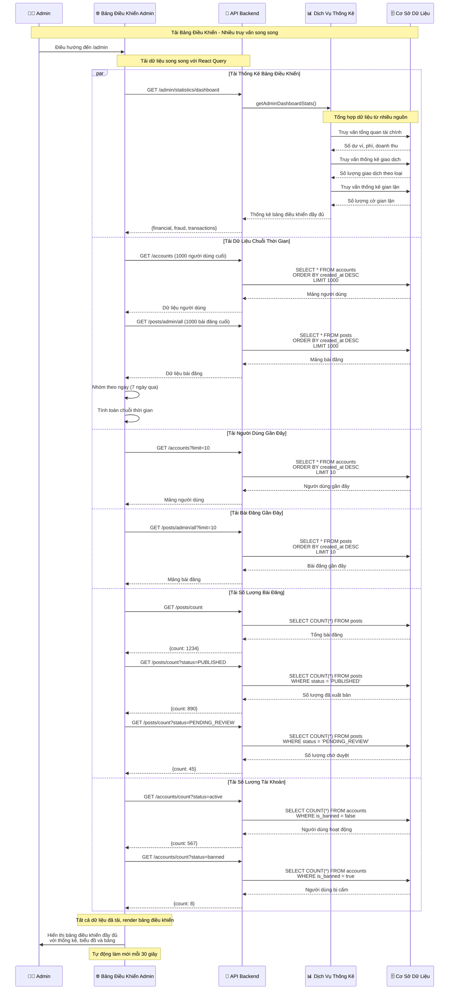
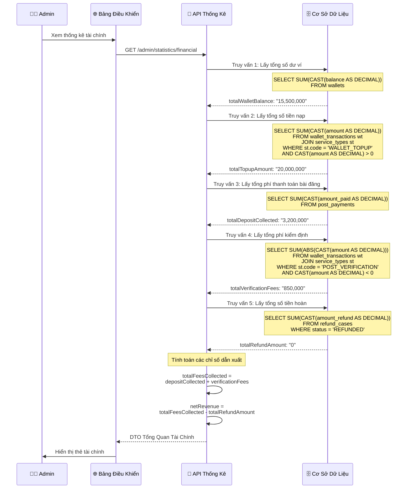
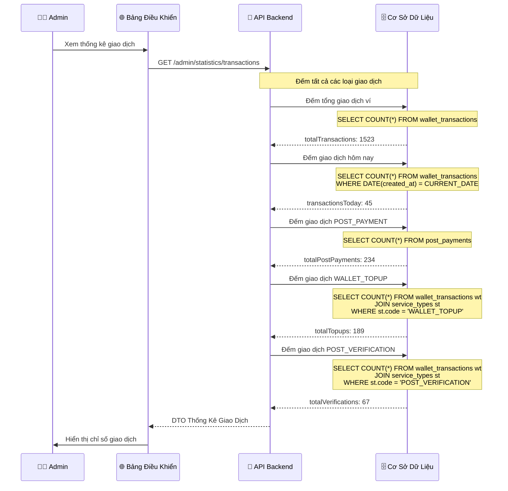
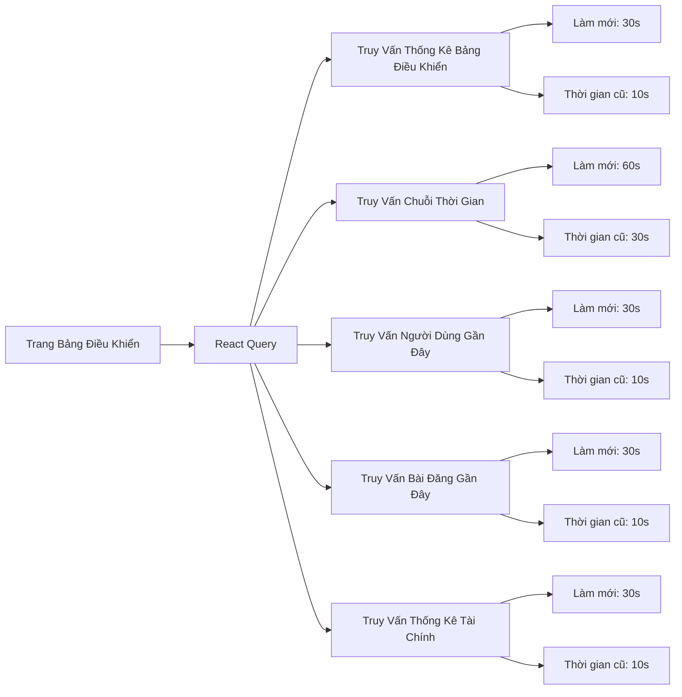
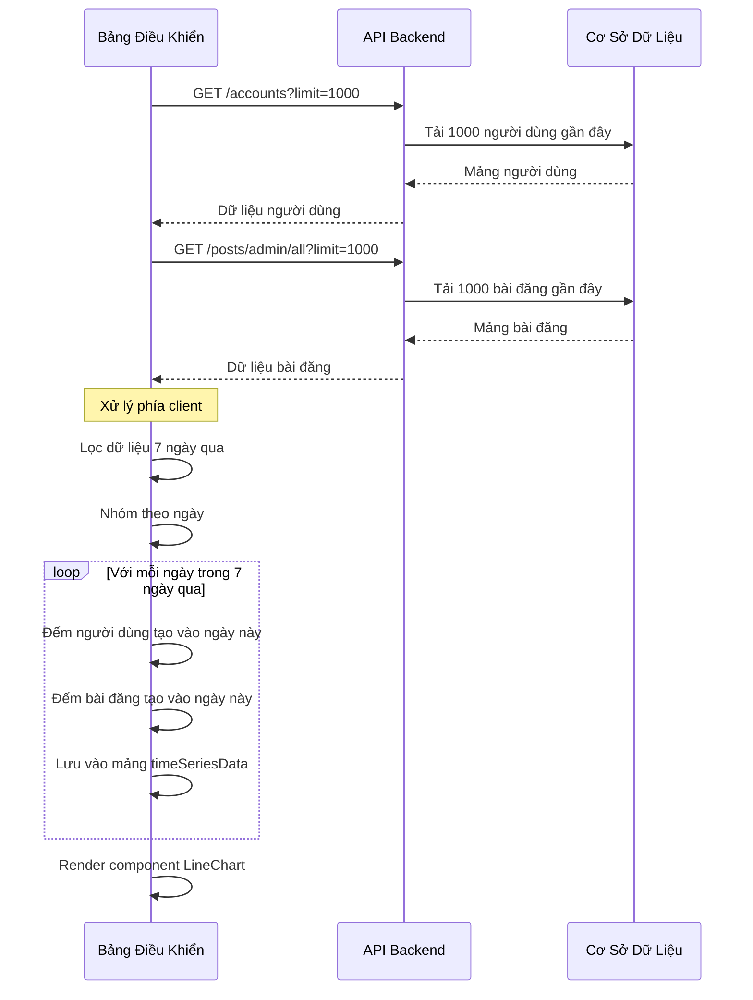

# Bảng Điều Khiển Admin & Báo Cáo

## Tổng Quan

Bảng điều khiển Admin cung cấp các thống kê và báo cáo toàn diện về hoạt động của hệ thống, bao gồm: tài chính, người dùng, bài đăng, giao dịch và phát hiện gian lận.

---

## Kiến Trúc Bảng Điều Khiển

```mermaid
graph TD
    A[Trang Bảng Điều Khiển Admin] --> B[Thẻ Thống Kê]
    A --> C[Thẻ Thống Kê Tài Chính]
    A --> D[Biểu Đồ Bảng Điều Khiển]
    A --> E[Bảng Dữ Liệu Gần Đây]
    
    B --> B1[Tổng Người Dùng]
    B --> B2[Tổng Bài Đăng]
    B --> B3[Người Dùng Hoạt Động]
    B --> B4[Người Dùng Mới Hôm Nay]
    B --> B5[Bài Đăng Theo Trạng Thái]
    B --> B6[Bài Đăng Theo Loại]
    
    C --> C1[Tổng Số Dư Ví]
    C --> C2[Tổng Số Tiền Nạp]
    C --> C3[Tổng Phí Thu Được]
    C --> C4[Tổng Tiền Đặt Cọc Thu Được]
    C --> C5[Tổng Phí Kiểm Định]
    C --> C6[Doanh Thu Ròng]
    
    D --> D1[Biểu Đồ Tăng Trưởng Người Dùng]
    D --> D2[Biểu Đồ Tăng Trưởng Bài Đăng]
    D --> D3[Phân Phối Trạng Thái Bài Đăng]
    D --> D4[Phân Phối Loại Bài Đăng]
    
    E --> E1[Bảng Người Dùng Gần Đây]
    E --> E2[Bảng Bài Đăng Gần Đây]
```



---

## 1. Quy Trình Thống Kê Bảng Điều Khiển

### Biểu Đồ Trình Tự



---

## 2. Quy Trình Thống Kê Tài Chính

### Biểu Đồ Luồng Dữ Liệu

```mermaid
graph LR
    A[API Tổng Quan Tài Chính] --> B[Lấy Tổng Số Dư Ví]
    A --> C[Lấy Tổng Số Tiền Nạp]
    A --> D[Lấy Tổng Phí Thu Được]
    A --> E[Tính Doanh Thu Ròng]
    
    B --> B1[(bảng wallets)]
    B1 --> B2[TỔNG balance]
    
    C --> C1[(wallet_transactions)]
    C1 --> C2[Lọc: service_type=WALLET_TOPUP]
    C2 --> C3[TỔNG amount WHERE amount > 0]
    
    D --> D1[Lấy Phí Thanh Toán Bài Đăng]
    D --> D2[Lấy Phí Kiểm Định]
    
    D1 --> D1a[(post_payments)]
    D1a --> D1b[TỔNG amount_paid]
    
    D2 --> D2a[(wallet_transactions)]
    D2a --> D2b[Lọc: service_type=POST_VERIFICATION]
    D2b --> D2c[TỔNG ABS(amount) WHERE amount < 0]
    
    E --> E1[Tổng Phí - Tổng Hoàn Tiền]
    E1 --> E2[Doanh Thu Ròng]
```

### Ví Dụ Gọi API



---

## 3. Quy Trình Thống Kê Giao Dịch

### Biểu Đồ Trình Tự



---

## 4. Tổng Hợp Dữ Liệu Bảng Điều Khiển

### Cấu Trúc DTO Thống Kê Hoàn Chỉnh

```typescript
interface AdminDashboardStatistics {
  financial: {
    totalWalletBalance: string;        // Tổng số dư tất cả ví người dùng
    totalTopupAmount: string;          // Tổng tiền nạp qua PayOS
    totalWithdrawalAmount: string;     // Tổng tiền rút (tương lai)
    totalTransactions: number;         // Đếm tất cả giao dịch ví
    totalFeesCollected: string;        // Phí bài đăng + Phí kiểm định
    totalDepositCollected: string;     // Chỉ phí thanh toán bài đăng
    totalVerificationFees: string;     // Chỉ phí kiểm định
    totalRefundAmount: string;         // Tổng hoàn tiền đã phát hành
    netRevenue: string;                // Phí - Hoàn tiền
  };
  
  fraud: {
    totalFraudFlags: number;           // Đếm cờ gian lận
    suspectedCount: number;            // Nghi ngờ gian lận
    confirmedCount: number;            // Xác nhận gian lận
    refundRate: number;                // % Hoàn tiền (hiện tại là 0)
    totalRefundedPosts: number;        // Bài đăng có hoàn tiền
  };
  
  transactions: {
    totalTransactions: number;         // Tất cả giao dịch ví
    transactionsToday: number;         // Giao dịch hôm nay
    totalPostPayments: number;         // Số lượng thanh toán bài đăng
    totalTopups: number;               // Số lần nạp tiền
    totalVerifications: number;        // Số lượng kiểm định
  };
}
```

### Tính Toán Chỉ Số Chính

```mermaid
graph TD
    A[Bảng Điều Khiển Admin] --> B[Chỉ Số Tài Chính]
    A --> C[Chỉ Số Giao Dịch]
    A --> D[Chỉ Số Người Dùng]
    A --> E[Chỉ Số Bài Đăng]
    
    B --> B1[Tổng Số Dư Ví<br/>SUM wallets.balance]
    B --> B2[Tổng Nạp Tiền<br/>SUM wallet_transactions<br/>WHERE type=TOPUP]
    B --> B3[Tổng Phí<br/>SUM post_payments +<br/>SUM verification fees]
    B --> B4[Doanh Thu Ròng<br/>Phí - Hoàn Tiền]
    
    C --> C1[Tổng Giao Dịch<br/>COUNT wallet_transactions]
    C --> C2[Giao Dịch Hôm Nay<br/>COUNT WHERE date=today]
    C --> C3[Thanh Toán Bài Đăng<br/>COUNT post_payments]
    C --> C4[Nạp Tiền<br/>COUNT WHERE type=TOPUP]
    
    D --> D1[Tổng Người Dùng<br/>COUNT accounts]
    D --> D2[Người Dùng Hoạt Động<br/>COUNT WHERE is_banned=false]
    D --> D3[Người Dùng Mới Hôm Nay<br/>COUNT WHERE date=today]
    D --> D4[Người Dùng Bị Cấm<br/>COUNT WHERE is_banned=true]
    
    E --> E1[Tổng Bài Đăng<br/>COUNT posts]
    E --> E2[Bài Đăng Đã Xuất Bản<br/>COUNT WHERE status=PUBLISHED]
    E --> E3[Bài Đăng Chờ Duyệt<br/>COUNT WHERE status=PENDING]
    E --> E4[Bài Đăng Theo Loại<br/>COUNT GROUP BY post_type]
```



---

## 5. Cập Nhật Thời Gian Thực & Bộ Nhớ Đệm

### Chiến Lược React Query



### Cấu Hình Truy Vấn

```typescript
// Thống kê bảng điều khiển - làm mới mỗi 30s
const { data: stats } = useQuery({
  queryKey: ['admin-dashboard-stats'],
  queryFn: getDashboardStats,
  refetchInterval: 30000,
  staleTime: 10000,
});

// Thống kê tài chính - làm mới mỗi 30s
const { data: adminStats } = useQuery({
  queryKey: ['admin-dashboard-statistics'],
  queryFn: getAdminDashboardStatistics,
  refetchInterval: 30000,
  staleTime: 10000,
});

// Chuỗi thời gian - làm mới mỗi 60s
const { data: timeSeriesData } = useQuery({
  queryKey: ['admin-dashboard-timeseries'],
  queryFn: () => getTimeSeriesData(7), // 7 ngày qua
  refetchInterval: 60000,
  staleTime: 30000,
});

// Người dùng gần đây - làm mới mỗi 30s
const { data: recentUsers } = useQuery({
  queryKey: ['admin-recent-users'],
  queryFn: () => getRecentUsers(10),
  refetchInterval: 30000,
  staleTime: 10000,
});

// Bài đăng gần đây - làm mới mỗi 30s
const { data: recentPosts } = useQuery({
  queryKey: ['admin-recent-posts'],
  queryFn: () => getRecentPosts(10),
  refetchInterval: 30000,
  staleTime: 10000,
});
```

---

## 6. Biểu Đồ & Trực Quan Hóa

### Xử Lý Dữ Liệu Chuỗi Thời Gian



### Các Loại Biểu Đồ

**1. Biểu Đồ Tăng Trưởng Người Dùng (Biểu Đồ Đường)**
- Trục X: Ngày (7 ngày qua)
- Trục Y: Số người dùng mới
- Dữ liệu: Người dùng nhóm theo ngày `created_at`

**2. Biểu Đồ Tăng Trưởng Bài Đăng (Biểu Đồ Đường)**
- Trục X: Ngày (7 ngày qua)
- Trục Y: Số bài đăng mới
- Dữ liệu: Bài đăng nhóm theo ngày `created_at`

**3. Phân Phối Trạng Thái Bài Đăng (Biểu Đồ Tròn)**
- Phân đoạn: DRAFT, PENDING_REVIEW, PUBLISHED, REJECTED, PAUSED, SOLD, ARCHIVED
- Giá trị: Số lượng bài đăng cho mỗi trạng thái

**4. Phân Phối Loại Bài Đăng (Biểu Đồ Cột)**
- Trục X: Loại bài đăng (EV_CAR, EV_BIKE, BATTERY)
- Trục Y: Số lượng bài đăng
- Dữ liệu: Bài đăng nhóm theo `post_type`

---

## 7. Tóm Tắt API Endpoints

### Endpoints Thống Kê Bảng Điều Khiển

| Endpoint | Phương Thức | Mô Tả |
|----------|-------------|-------|
| `/admin/statistics/dashboard` | GET | Thống kê bảng điều khiển đầy đủ (tất cả trong một) |
| `/admin/statistics/financial` | GET | Chỉ tổng quan tài chính |
| `/admin/statistics/transactions` | GET | Chỉ thống kê giao dịch |
| `/admin/statistics/fraud` | GET | Thống kê gian lận & rủi ro |
| `/admin/statistics/wallet-balance` | GET | Tổng số dư ví |
| `/admin/statistics/total-topup` | GET | Tổng số tiền nạp |
| `/admin/statistics/total-deposit` | GET | Tổng tiền đặt cọc thu được |
| `/admin/statistics/total-revenue` | GET | Tổng doanh thu (phí - hoàn tiền) |

### Endpoints Đếm

| Endpoint | Phương Thức | Mô Tả |
|----------|-------------|-------|
| `/accounts/count` | GET | Đếm tất cả tài khoản |
| `/accounts/count?status=active` | GET | Đếm tài khoản hoạt động |
| `/accounts/count?status=banned` | GET | Đếm tài khoản bị cấm |
| `/posts/count` | GET | Đếm tất cả bài đăng |
| `/posts/count?status=PUBLISHED` | GET | Đếm bài đăng đã xuất bản |
| `/posts/count?status=PENDING_REVIEW` | GET | Đếm bài đăng chờ duyệt |

### Endpoints Danh Sách

| Endpoint | Phương Thức | Mô Tả |
|----------|-------------|-------|
| `/accounts?limit=10` | GET | Lấy 10 người dùng gần đây |
| `/posts/admin/all?limit=10` | GET | Lấy 10 bài đăng gần đây |
| `/posts/admin/all?status=PENDING_REVIEW&limit=50` | GET | Lấy bài đăng chờ duyệt |

---

## 8. Truy Vấn Cơ Sở Dữ Liệu Cho Thống Kê

### Truy Vấn Tài Chính

```sql
-- Tổng Số Dư Ví
SELECT SUM(CAST(balance AS DECIMAL)) AS total_balance
FROM wallets;

-- Tổng Số Tiền Nạp
SELECT SUM(CAST(wt.amount AS DECIMAL)) AS total_topup
FROM wallet_transactions wt
JOIN service_types st ON wt.service_type_id = st.id
WHERE st.code = 'WALLET_TOPUP'
  AND CAST(wt.amount AS DECIMAL) > 0;

-- Tổng Phí Thanh Toán Bài Đăng
SELECT SUM(CAST(amount_paid AS DECIMAL)) AS total_deposit
FROM post_payments;

-- Tổng Phí Kiểm Định
SELECT SUM(ABS(CAST(wt.amount AS DECIMAL))) AS total_verification_fees
FROM wallet_transactions wt
JOIN service_types st ON wt.service_type_id = st.id
WHERE st.code = 'POST_VERIFICATION'
  AND CAST(wt.amount AS DECIMAL) < 0;

-- Tổng Hoàn Tiền
SELECT SUM(CAST(amount_refund AS DECIMAL)) AS total_refunds
FROM refund_cases
WHERE status = 'REFUNDED';

-- Doanh Thu Ròng
SELECT 
  (SELECT SUM(CAST(amount_paid AS DECIMAL)) FROM post_payments) +
  (SELECT SUM(ABS(CAST(wt.amount AS DECIMAL))) 
   FROM wallet_transactions wt
   JOIN service_types st ON wt.service_type_id = st.id
   WHERE st.code = 'POST_VERIFICATION' AND CAST(wt.amount AS DECIMAL) < 0) -
  (SELECT COALESCE(SUM(CAST(amount_refund AS DECIMAL)), 0) FROM refund_cases WHERE status = 'REFUNDED')
AS net_revenue;
```

### Truy Vấn Giao Dịch

```sql
-- Tổng Giao Dịch
SELECT COUNT(*) AS total_transactions
FROM wallet_transactions;

-- Giao Dịch Hôm Nay
SELECT COUNT(*) AS transactions_today
FROM wallet_transactions
WHERE DATE(created_at) = CURRENT_DATE;

-- Số Lượng Thanh Toán Bài Đăng
SELECT COUNT(*) AS total_post_payments
FROM post_payments;

-- Số Lần Nạp Tiền
SELECT COUNT(*) AS total_topups
FROM wallet_transactions wt
JOIN service_types st ON wt.service_type_id = st.id
WHERE st.code = 'WALLET_TOPUP';

-- Số Lượng Kiểm Định
SELECT COUNT(*) AS total_verifications
FROM wallet_transactions wt
JOIN service_types st ON wt.service_type_id = st.id
WHERE st.code = 'POST_VERIFICATION';
```

### Truy Vấn Người Dùng & Bài Đăng

```sql
-- Tổng Người Dùng
SELECT COUNT(*) AS total_users FROM accounts;

-- Người Dùng Hoạt Động
SELECT COUNT(*) AS active_users
FROM accounts
WHERE is_banned = false;

-- Người Dùng Bị Cấm
SELECT COUNT(*) AS banned_users
FROM accounts
WHERE is_banned = true;

-- Tổng Bài Đăng
SELECT COUNT(*) AS total_posts FROM posts;

-- Bài Đăng Đã Xuất Bản
SELECT COUNT(*) AS published_posts
FROM posts
WHERE status = 'PUBLISHED';

-- Bài Đăng Chờ Duyệt
SELECT COUNT(*) AS pending_posts
FROM posts
WHERE status = 'PENDING_REVIEW';

-- Bài Đăng Theo Loại
SELECT 
  post_type,
  COUNT(*) AS count
FROM posts
GROUP BY post_type;

-- Bài Đăng Theo Trạng Thái
SELECT 
  status,
  COUNT(*) AS count
FROM posts
GROUP BY status;
```

---

## 9. Tối Ưu Hiệu Suất

### Chiến Lược Tối Ưu Truy Vấn

1. **Đánh Index**
```sql
-- Index cho việc đếm nhanh
CREATE INDEX idx_posts_status ON posts(status);
CREATE INDEX idx_posts_post_type ON posts(post_type);
CREATE INDEX idx_accounts_is_banned ON accounts(is_banned);
CREATE INDEX idx_wallet_transactions_created_at ON wallet_transactions(created_at);
CREATE INDEX idx_posts_created_at ON posts(created_at);

-- Index phức hợp cho truy vấn phổ biến
CREATE INDEX idx_wallet_transactions_service_type ON wallet_transactions(service_type_id);
```

2. **Chiến Lược Bộ Nhớ Đệm**
- **React Query**: Bộ nhớ đệm phía client với interval làm mới 30s
- **Backend Caching** (tùy chọn): Redis cho truy vấn đếm (TTL 5 phút)
- **Database Views** (tùy chọn): Materialized views cho tổng hợp phức tạp

3. **Phân Trang**
- Sử dụng `LIMIT` và `OFFSET` cho tập dữ liệu lớn
- Triển khai hiện tại: Tải 1000 bản ghi cuối cho chuỗi thời gian
- Cân nhắc phân trang phía server cho bảng điều khiển lớn

4. **Truy Vấn Song Song**
- Frontend: Sử dụng `Promise.all()` cho gọi API song song
- Backend: Sử dụng thực thi truy vấn song song của TypeORM
- React Query: Truy vấn song song tự động với các key riêng biệt

---

## 10. Kiểm Thử & Giám Sát

### Danh Sách Kiểm Tra

**Unit Tests:**
- [ ] Tính toán tài chính chính xác
- [ ] Truy vấn đếm trả về số chính xác
- [ ] Nhóm chuỗi thời gian hoạt động đúng
- [ ] Xử lý lỗi cho dữ liệu thiếu

**Integration Tests:**
- [ ] Tất cả API endpoints trả về dữ liệu mong đợi
- [ ] Truy vấn thực thi trong giới hạn hiệu suất (< 1s)
- [ ] Yêu cầu đồng thời không gây race condition

**E2E Tests:**
- [ ] Bảng điều khiển tải tất cả dữ liệu thành công
- [ ] Biểu đồ render chính xác
- [ ] Cập nhật thời gian thực hoạt động như mong đợi
- [ ] Trạng thái lỗi hiển thị đúng

### Chỉ Số Giám Sát

- **Thời Gian Phản Hồi API**: Mục tiêu < 1 giây
- **Thời Gian Truy Vấn Cơ Sở Dữ Liệu**: Mục tiêu < 500ms
- **Tỷ Lệ Trúng Cache**: Mục tiêu > 80% (nếu triển khai caching)
- **Thời Gian Tải Bảng Điều Khiển**: Mục tiêu < 3 giây
- **Tỷ Lệ Thành Công Tự Động Làm Mới**: Mục tiêu > 99%

---

## Tóm Tắt

### Tính Năng Đã Triển Khai

| Tính Năng | Trạng Thái | Mô Tả |
|-----------|------------|-------|
| **Thống Kê Bảng Điều Khiển** | ✅ Đã triển khai | Số lượng người dùng, bài đăng và giao dịch |
| **Tổng Quan Tài Chính** | ✅ Đã triển khai | Số dư ví, phí, theo dõi doanh thu |
| **Biểu Đồ Chuỗi Thời Gian** | ✅ Đã triển khai | Tăng trưởng người dùng & bài đăng trong 7 ngày |
| **Biểu Đồ Phân Phối** | ✅ Đã triển khai | Phân phối trạng thái & loại bài đăng |
| **Bảng Dữ Liệu Gần Đây** | ✅ Đã triển khai | Người dùng và bài đăng gần đây |
| **Cập Nhật Thời Gian Thực** | ✅ Đã triển khai | Tự động làm mới mỗi 30-60s |
| **Thống Kê Giao Dịch** | ✅ Đã triển khai | Số lượng giao dịch theo loại |
| **Phát Hiện Gian Lận** | ⚠️ Placeholder | Trả về 0 (đã xóa phát hiện gian lận) |

### Công Nghệ Chính

- **Frontend**: Next.js, React Query, Recharts (cho biểu đồ)
- **Backend**: NestJS, TypeORM
- **Cơ sở dữ liệu**: PostgreSQL với truy vấn tổng hợp
- **Bộ nhớ đệm**: React Query bộ nhớ đệm phía client

### Các Bảng Cơ Sở Dữ Liệu Được Sử Dụng

- `accounts` - Thống kê người dùng
- `posts` - Thống kê bài đăng
- `wallets` - Số dư ví
- `wallet_transactions` - Lịch sử giao dịch
- `post_payments` - Theo dõi thanh toán bài đăng
- `service_types` - Ánh xạ loại dịch vụ
- `refund_cases` - Theo dõi hoàn tiền
- `post_verification_requests` - Thống kê kiểm định
